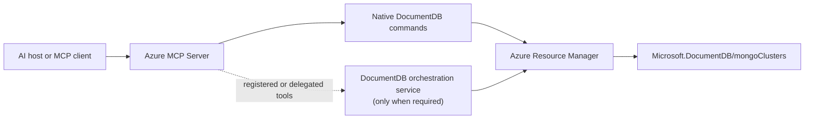

# Azure DocumentDB Control Plane MCP: Full Feature Proposal

> **Status:** Full-feature architecture proposal; read-only POC validated
>
> **Decision owner:** TBD
>
> **Proposed ownership:** DocumentDB owns tool behavior; Azure MCP owns the
> integration and distribution framework
>
> **Target decision date:** TBD
>
> **Last updated:** 2026-08-28

## 1. Executive Proposal

Make Azure MCP the primary user entry point for managing the Azure resource
type `Microsoft.DocumentDB/mongoClusters`.

Use native Azure MCP commands for stateless ARM operations when Azure MCP can
provide the required identity, confirmation, long-running-operation, and
telemetry behavior. Add a DocumentDB-owned orchestration component only for
capabilities that require durable workflow state, independent backend identity,
multi-step rollback, or service-owned execution. If that component is needed,
expose it through Azure MCP so users still have one control-plane entry point.

The read-only POC proves the native path for discovery and configuration
retrieval, not for mutations or durable workflows. Keep the existing MongoDB
wire-protocol data-plane MCP and diagnostic tooling separate from authorized
ARM execution.

## 2. Goals and Scope

### 2.1 Goals

- Expose the supported cluster lifecycle through stable, service-specific
  tools while preserving ARM RBAC and end-user attribution.
- Apply controls according to operation risk and keep secrets and raw ARM
  payloads out of ordinary responses.
- Support local and remote Azure MCP with a path from direct ARM operations to
  durable workflows, without a second mandatory client endpoint.

### 2.2 Target capability domains

The target includes these domains, subject to ARM support and product approval:

| Domain | Representative capabilities |
| --- | --- |
| Discovery and configuration | List and get clusters, available regions and tiers, name availability |
| Cluster lifecycle | Create, update, scale, and delete clusters |
| Networking | Public access, firewall rules, private-link configuration, private-endpoint connection state |
| Resilience | High availability, replicas, promotion or failover where supported |
| Backup and restore | Backup configuration, restore eligibility, and point-in-time restore |
| Operations | Start operations, return tracking handles, and retrieve long-running-operation status |
| Governance | Tags, cost and disruption previews, policy guardrails, and activity history |
| Advanced workflows | Plan, approve, apply, retry, undo, redo, drift detection, and runbooks where durable state is required |

Derive the exact catalog from stable ARM operations and user scenarios. This
table does not assert that every capability exists in the current API.

### 2.3 Boundaries

- Document, collection, index, and query operations remain data-plane concerns;
  Azure Monitor and Log Analytics remain diagnostic concerns.
- ARM remains the system of record and authorization authority.
- Connection-string and credential retrieval are excluded by default. Any
  model-visible secret operation requires a separate security decision.
- Irreversible Azure operations have no automatic rollback.
- Prompt text and client confirmation alone are not authorization boundaries.

## 3. Architecture and Azure MCP Integration

### 3.1 Capability placement

| Requirement | Default placement |
| --- | --- |
| Read or one-to-one ARM mutation with no durable state | Native Azure MCP command |
| ARM long-running operation that Azure MCP can safely start and poll | Native Azure MCP command |
| Multi-step workflow, durable approval, replay, or coordinated rollback | DocumentDB-owned orchestration component |
| Backend identity independently constrained from Azure MCP | DocumentDB-owned orchestration component |
| Direct DocumentDB-specific MCP endpoint | Dedicated server, only if this becomes a product requirement |

A separate process adds a security boundary only with independently constrained
credentials, RBAC, policy, or deployment. A different token audience alone
does not justify it.

### 3.2 Identity

| Scenario | Preferred identity | Attribution |
| --- | --- | --- |
| Local Azure MCP | Selected user credential | End user in ARM |
| Shared remote Azure MCP | Delegated OBO credential | End user in ARM |
| Fixed automation | Hosting managed identity after security approval | Service identity plus explicit caller correlation |

Managed identity is not the interactive default because it weakens direct ARM
attribution. Add service-side scope policy only when RBAC needs further
narrowing.

## 4. POC Evidence

The POC added two native Azure MCP tools:

- `documentdb_cluster_list`, backed by typed subscription or resource-group ARM
  enumeration; and
- `documentdb_cluster_get`, backed by a current ARM resource GET.

It demonstrated MCP and natural-language discovery, Azure MCP identity and
read-only integration, both enumeration scopes, typed paging with a response
cap, and allowlisted serialization that excludes credentials, tags, and raw
private-endpoint payloads.

### 4.1 Generic capability comparison

| Existing capability | POC finding |
| --- | --- |
| Resource-group resource list | Returns generic name, ID, type, and location, but requires a known resource group |
| Generic ARM or Resource Graph query | Can discover clusters, but the caller controls projection and paging behavior |
| Resource Graph operational fields | `earliestRestoreTime` was stale for four of six compared clusters, sometimes by nearly 24 hours |
| Native DocumentDB list and get | Provide a stable schema, current direct ARM data, and a server-enforced output allowlist |

The POC does not create new Azure data. It productizes existing ARM data as a
predictable DocumentDB contract.

### 4.2 POC limits

| Not proven by the POC | Consequence for the proposal |
| --- | --- |
| Mutations, ETags, idempotency, or LRO recovery | Validate before selecting the mutation architecture |
| Durable approval, journals, undo, redo, or runbooks | Treat the orchestration component as conditional |
| Firewall rules, private endpoints, or other child resources | Do not call the current response complete network posture |
| Production OBO, managed identity, sovereign clouds, telemetry, or support | Keep these as release decisions and gates |

The agent used MCP for root-cluster configuration but used Azure CLI for scope
resolution and private-endpoint checking. "Configuration posture" therefore
means a root-resource snapshot, not complete health, diagnostics, or child
state. MCP-only workflows require host tool restrictions; prompt wording cannot
prevent shell use. Inspector validates the protocol, while an AI host validates
natural-language routing. Azure MCP exposes tools, not runtime MCP prompt
templates; its end-to-end prompt file is test data.

## 5. Capability and Risk Model

Retain the staged model from the original control-plane plan, but apply it per
operation rather than per server.

| Tier | Examples | Required controls |
| --- | --- | --- |
| Read | List, get, network state, backup state, operation status | ARM read permission, output allowlist, paging limits |
| Non-destructive mutation | Scale compute, add a firewall rule, update tags | Explicit desired state, confirmation, ETag where supported, idempotent retry |
| Destructive or irreversible mutation | Delete, disable protection, promote, restore | Impact preview, explicit confirmation, stronger RBAC, no false rollback promise |
| Durable workflow | Multi-step change, approval separation, undo or redo | Persisted plan and journal, caller binding, expiry, drift checks, recovery |

Use Azure MCP's normal mutation and elicitation patterns for ordinary writes.
Add `plan -> approve -> apply` only when approval must survive a client session,
use a separate approver, or coordinate operations. Such plans must be
single-use, caller-bound, persisted in a production store, and revalidated
before execution. Retry uses an idempotency record, undo creates a compensating
plan, drift blocks replay, and irreversible operations promise no inverse.

## 6. Safety and Execution Contract

### 6.1 Authorization and policy

- ARM RBAC is authoritative; local user credentials and remote OBO preserve
  caller attribution.
- Grant each execution identity only the ARM actions required for its approved
  tier; do not default mutating automation to Contributor.
- Azure MCP read-only mode filters and rejects mutation tools.
- Every tool declares accurate destructive, idempotent, read-only, open-world,
  secret, and local-required metadata.
- Add cost, region, maintenance-window, protected-tag, or network-range
  guardrails only when product requirements justify them.
- No `force` parameter bypasses required confirmation or approval.

### 6.2 Mutation correctness

- Read current state and present the material diff, cost direction, disruption,
  reversibility, and preconditions.
- Use conditional requests or ETags where the ARM API and SDK support them.
- Treat 412 as state drift, not a retryable transport failure.
- Return a tracking handle for long-running work instead of holding an MCP
  request open; provide status retrieval and reject conflicting mutations.
- Do not retry non-idempotent work without durable idempotency.

### 6.3 Data and secrets

- Return allowlisted DTOs, never raw ARM or SDK models, and preserve null for
  unavailable values.
- Exclude connection strings, administrator credentials, tokens, customer
  key material, and raw private-endpoint payloads from ordinary responses.
- Creation or rotation workflows that require a secret use an approved
  out-of-band input, such as a Key Vault reference resolved by a trusted
  component, rather than plaintext prompt arguments.
- Mark tools as secret-handling when sensitive data passes through them, even
  if discarded, and require client elicitation. Disable elicitation only in a
  trusted local POC.

The current get tool reports public access and bypass mode, not private-endpoint
existence. Add an approved child-resource state or count if that answer is
required; do not return raw private-endpoint objects.

## 7. API and Data Strategy

- Use stable, pinned ARM API versions and typed management SDKs where available.
- Use direct ARM reads for current configuration and operation state.
- Use Resource Graph for broad cross-resource discovery only when its
  consistency and field contract are acceptable for the scenario.
- Keep service paging inside the implementation. Do not accept arbitrary ARM
  continuation URLs from model-controlled input.
- Model child resources, including firewall rules and private-link state,
  through dedicated contracts and permissions.
- Validate API availability per cloud. The POC is explicitly Azure Public
  Cloud only.

The POC uses `Azure.ResourceManager.MongoCluster` 1.1.0 and stable API
`2026-06-01`. Exact SDK methods, DTO fields, sanitizers, and repository file
changes belong in the implementation plan rather than this proposal.

## 8. Observability and Operations

- Use Azure MCP telemetry and ARM Activity Log attribution for duration,
  outcomes, and correlation.
- Log only safe identifiers and status metadata, never tokens, credentials,
  tags, raw options, request bodies, or ARM responses.
- MCP Logging support does not require an application success log for every
  call.
- Durable journals record plans, approvals, preconditions, operation handles,
  outcomes, and compensating actions.
- Assign DocumentDB owners for tool behavior and an Azure MCP contact for
  framework, intake, and release issues.

Production design covers throttling, ETag conflicts, token expiry, partial
failure, orphaned operations, store recovery, and instance failover.

## 9. Delivery and Validation

| Phase | Deliverable | Exit criterion |
| --- | --- | --- |
| 0. POC | Native list and get | Complete: live discovery, routing, ARM calls, and safe output demonstrated |
| 1. Architecture and intake | Approved capability catalog, placement, namespace, identity, owners, and cloud scope | DocumentDB and Azure MCP owners approve the full-feature direction |
| 2. Read foundation | Production list/get plus approved network, backup, replica, and operation reads | Safe contracts, RBAC, paging, errors, telemetry, and release checks pass |
| 3. Standard mutations | One-to-one create, update, scale, network, and lifecycle operations | Confirmation, concurrency, idempotency, LRO, cost, and disruption behavior pass |
| 4. Durable workflows | Only approved workflows needing persistent plans, journals, undo, redo, or runbooks | Multi-user recovery, drift, replay, and audit requirements pass |
| 5. Release | Supported Azure MCP distribution | Tools are discoverable, documented, owned, monitored, and supportable |

Azure MCP currently recommends one tool per pull request. Delivery can be
incremental without redefining the full-feature architecture as an MVP.

### 9.1 Current validation status

The POC passed unit, live ARM, local record/playback, build, metadata, routing,
and output-safety checks. Recording publication awaits
`Azure/azure-sdk-assets` permission. Tool-description evaluation, intake,
production telemetry, mutations, and non-public clouds remain release work.

### 9.2 Full-feature acceptance

The full feature is complete when every capability has a risk-tiered contract;
RBAC and identity preserve scope; read-only mode contains no mutation path;
mutations handle impact, concurrency, retry, and LROs safely; prohibited data
cannot reach output, logs, recordings, or model context; durable workflows
survive restart, duplicates, drift, and partial failure; supported hosts honor
tool selection and elicitation; every cloud is tested; and ownership,
monitoring, support, documentation, and release paths are approved.

## 10. Decisions Requested

| Decision | Proposed default | Approver |
| --- | --- | --- |
| Primary entry point | Azure MCP | DocumentDB product and Azure MCP owners |
| Native namespace | `documentdb` | Azure MCP maintainer |
| Stateless ARM operations | Native Azure MCP commands | Engineering owners |
| Durable orchestration | Add only for workflows that require persistent state | Product, security, and engineering owners |
| Interactive identity | Local user credential or remote OBO | Security owner |
| Automation identity | Managed identity only for approved service execution | Security and service owners |
| Credential-returning tools | Excluded unless separately approved | Product and security owners |
| Initial cloud | Azure Public; expand only with evidence | Product owner |
| Full capability catalog | Derive from supported ARM operations and user scenarios | Product and control-plane owners |
| Support ownership | Named DocumentDB owner plus Azure MCP intake contact | Engineering managers |

## 11. Key Risks

| Risk | Mitigation |
| --- | --- |
| Generic tools make specialized tools appear redundant | Define value as stable service contracts, current state, safe output, and workflow semantics |
| Native Azure MCP cannot host required durable state | Use a DocumentDB-owned orchestration component behind the Azure MCP entry point |
| A separate component is assumed to be safer without an independent identity | Require explicit RBAC, credential, policy, and deployment boundaries |
| Agent uses shell or unrelated tools to fill gaps | Restrict host tools for controlled workflows and expose missing safe contracts intentionally |
| Mutation retry or rollback is unsafe | Use conditional writes, operation handles, idempotency records, and per-operation reversibility |
| Sensitive ARM fields leak | Use exact DTO allowlists, secret metadata, sanitizers, and regression tests |
| Scope outruns ownership | Gate each domain on owners, API support, tests, and operational readiness |

## 12. References

- [Azure MCP tools and security model](https://learn.microsoft.com/azure/developer/azure-mcp-server/tools/)
- [Azure MCP contribution guide](https://github.com/microsoft/mcp/blob/main/CONTRIBUTING.md)
- [Azure MCP authentication model](https://github.com/microsoft/mcp/blob/main/docs/Authentication.md)
- [Azure Resource Graph overview](https://learn.microsoft.com/azure/governance/resource-graph/overview)
- [.NET MongoCluster SDK 1.1.0](https://www.nuget.org/packages/Azure.ResourceManager.MongoCluster/1.1.0)
- [`Microsoft.DocumentDB/mongoClusters` ARM reference](https://learn.microsoft.com/azure/templates/microsoft.documentdb/mongoclusters)
- [`Microsoft.DocumentDB/mongoClusters` REST specification](https://github.com/Azure/azure-rest-api-specs/tree/main/specification/mongocluster/resource-manager/Microsoft.DocumentDB/MongoCluster)
