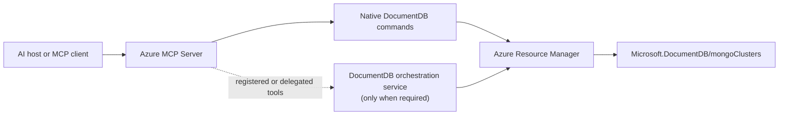

# Azure DocumentDB Control Plane MCP: Full Feature Proposal

> **Status:** Draft full-feature architecture proposal
>
> **Target:** Full cluster lifecycle, including create, update, scale, restore,
> replica operations, and delete
>
> **Validated so far:** Read-only cluster list/get POC
>
> **Decision owner:** TBD
>
> **Proposed ownership:** DocumentDB owns tool behavior; Azure MCP owns the
> integration and distribution framework
>
> **Target decision date:** TBD
>
> **Last updated:** 2026-08-28

## 1. Executive Proposal

Make Azure MCP the primary user entry point for managing the Azure resource
type `Microsoft.DocumentDB/mongoClusters`.

**Default implementation decision:** contribute first-party DocumentDB tools to
the `microsoft/mcp` codebase and ship them inside Azure MCP Server. Do not build
a standalone DocumentDB control-plane MCP server for the default path.

Build a first-party `documentdb` toolset inside Azure MCP Server. Operations
that map to one supported Azure Resource Manager (ARM) operation, including an
asynchronous ARM operation, run as native Azure MCP commands. Examples include
getting or creating a cluster and changing its compute tier. Azure MCP supplies
the protocol endpoint, tool discovery and routing, Azure identity, read-only
enforcement, confirmation, and telemetry conventions. DocumentDB supplies the
operation contract, ARM call, safe response, tests, and service ownership.

Add a DocumentDB-owned orchestration component only if a workflow must retain
state across client sessions, coordinate multiple approvers or ARM operations,
or execute under an independently constrained service identity. An approved
multi-step point-in-time restore is a possible example, if its final
requirements need durable approval and recovery. The component would remain
behind Azure MCP so the user still configures one control-plane endpoint.

The read-only POC proves the native path for discovery and configuration
retrieval, not for mutations or durable workflows. The default proposal does
not create or deploy a second DocumentDB control-plane MCP server. Keep the
existing MongoDB wire-protocol data-plane MCP separate.

This proposal asks reviewers to approve the integration direction, ownership,
and target-versus-candidate operation split. It does not approve every mutation
for production. Each command still requires its own Azure MCP contribution,
risk controls, validation, and maintainer approval.

## 2. Goals and Scope

### 2.1 Goals

- Expose the supported cluster lifecycle through stable, service-specific
  tools while preserving ARM RBAC and end-user attribution.
- Apply controls according to operation risk and keep secrets and raw ARM
  payloads out of ordinary responses.
- Support local and remote Azure MCP with a path from direct ARM operations to
  durable workflows, without a second mandatory client endpoint.

### 2.2 Target capability domains

The target and conditional areas are separated below. Appendix A lists the
individual operations and their evidence.

| Domain | Target product scope | Conditional or separately approved |
| --- | --- | --- |
| Discovery and configuration | List/get clusters, check name availability, and read approved child-resource state | Region and tier catalogs if a stable API contract is identified |
| Cluster lifecycle | Create; update compute, storage, shard count, high availability, server version, network mode, and tags; delete | Data API, authentication-mode, identity, and customer-managed-key changes |
| Networking | Read public access, firewall rules, private-link resources, and private-endpoint connection state; mutate firewall rules and approve/reject endpoint connections | Creation of the `Microsoft.Network/privateEndpoints` resource if a cross-provider workflow is required |
| Resilience | List and create replicas; promote a replica with high-risk controls | Automated failover decisions and multi-step recovery runbooks |
| Backup and restore | Read restore eligibility and earliest restore time; create a point-in-time restore | Restore-point enumeration if a stable API is added |
| Operations | Start supported ARM operations and retrieve status through safe tracking handles | Cancellation where the resource provider supports it |
| Governance | Tags, impact and cost-direction previews, and Activity Log correlation | Product-specific policy, maintenance-window, and exact-cost rules |
| Access management | None in the baseline | ARM-managed users/roles and administrator rotation after separate security approval |
| Durable workflows | None by default | Persisted plan/approve/apply, compensating actions, reapplication, drift detection, and runbooks for selected operations |

### 2.3 Boundaries

- Document, collection, index, and query operations remain data-plane concerns.
- Azure Monitor and Log Analytics remain the primary telemetry query surfaces;
  Appendix B describes how their existing MCP tools complement this proposal.
- ARM remains the system of record and authorization authority.
- Connection-string and credential retrieval are excluded by default. Any
  model-visible secret operation requires a separate security decision.
- Irreversible Azure operations have no automatic rollback.
- Prompt text and client confirmation alone are not authorization boundaries.

## 3. Architecture and Azure MCP Integration



### 3.1 What we develop

| Deliverable | Contents | Owner and deployment |
| --- | --- | --- |
| Native DocumentDB toolset | `documentdb` command group, operation implementations, typed SDK service, allowlisted response models, and option validation in `microsoft/mcp` | DocumentDB-owned code merged into and shipped with Azure MCP |
| Azure MCP integration | Tool registration, consolidated routing, metadata, read-only filtering, elicitation, tests, command documentation, and routing prompts | Joint DocumentDB and Azure MCP review; shipped through the normal Azure MCP release |
| Optional orchestration component | Durable plans, approvals, journals, operation recovery, and separately constrained execution only for approved workflows | DocumentDB deploys and operates it; Azure MCP exposes it through an approved integration |

The first two rows are the proposed default. The third is not a prerequisite
for ordinary reads or one-resource mutations.

### 3.2 How a request works

1. The user asks an AI host that is connected to Azure MCP to inspect or change
   a DocumentDB cluster.
2. Azure MCP exposes or selects the `documentdb` command, applies namespace and
   read-only filters, and obtains the local user or delegated remote identity.
3. The command validates the requested scope and desired state. For a mutation,
   it produces the required preview and confirmation flow described in
   Section 5.
4. The native command calls the stable MongoCluster ARM API through the typed
   management SDK. ARM performs the authoritative role-based access control
   (RBAC) check.
5. The command returns an allowlisted result or a safe tracking handle for an
   asynchronous operation. Raw ARM payloads and polling URLs are not accepted
   from model-controlled input.

The agent and user configure only Azure MCP. The native path does not call a
DocumentDB service owned by this proposal and does not depend on Azure CLI.

### 3.3 Capability placement

| Requirement | Default placement |
| --- | --- |
| Read or one-resource ARM mutation with no durable state | Native Azure MCP command |
| ARM long-running operation that Azure MCP can safely start and poll | Native Azure MCP command |
| Multi-step workflow, durable approval, replay, or coordinated compensation | DocumentDB-owned orchestration component |
| Backend identity independently constrained from Azure MCP | DocumentDB-owned orchestration component |
| Direct DocumentDB-specific MCP endpoint | Dedicated server, only if this becomes a product requirement |

A separate process adds a security boundary only with independently constrained
credentials, RBAC, policy, or deployment. A different token audience alone
does not justify it.

### 3.4 Identity

| Scenario | Preferred identity | Attribution |
| --- | --- | --- |
| Local Azure MCP | Selected user credential | End user in ARM |
| Shared remote Azure MCP | Delegated on-behalf-of (OBO) credential | End user in ARM |
| Fixed automation | Hosting managed identity after security approval | Service identity plus explicit caller correlation |

Managed identity is not the interactive default because it weakens direct ARM
attribution. Add service-side scope policy only when RBAC needs further
narrowing.

### 3.5 Review, packaging, and deployment

Native commands follow the Azure MCP contribution path:

1. DocumentDB and Azure MCP owners agree on the namespace, command contract,
   owners, and first operation through Azure MCP intake.
2. Each command starts with an issue and normally lands as one tool per pull
   request with implementation, tests, metadata, documentation, routing, and
   evaluation evidence.
3. DocumentDB reviewers approve service behavior and support ownership. Azure
   MCP maintainers approve the integration and merge. Product and security
   owners approve the capability and controls required by its risk tier.
4. After merge, Azure MCP's standard pipeline builds the command into the same
   signed Azure MCP distribution. Users receive it through their normal Azure
   MCP update path; DocumentDB has no separate native-tool deployment.

Local and remote Azure MCP deployments expose the same command contract but
use the identity model in Section 3.4. If a durable orchestration component is
approved later, DocumentDB must deploy, secure, monitor, and support that
service separately, and Azure MCP maintainers must approve how it is exposed.

## 4. POC Evidence

The POC added two native Azure MCP tools:

- `documentdb_cluster_list`, backed by typed subscription or resource-group ARM
  enumeration; and
- `documentdb_cluster_get`, backed by a current ARM resource GET.

It demonstrated MCP and natural-language discovery, Azure MCP identity and
read-only integration, both enumeration scopes, typed paging with a response
cap, and allowlisted serialization that excludes credentials, tags, and raw
private-endpoint payloads.

### 4.1 Generic capability comparison

| Existing capability | POC finding |
| --- | --- |
| Resource-group resource list | Returns generic name, ID, type, and location, but requires a known resource group |
| Generic ARM or Resource Graph query | Can discover clusters, but the caller controls projection and paging behavior |
| Resource Graph operational fields | `earliestRestoreTime` was stale for four of six compared clusters, sometimes by nearly 24 hours |
| Native DocumentDB list and get | Provide a stable schema, current direct ARM data, and a server-enforced output allowlist |

The POC does not create new Azure data. It adds a predictable,
DocumentDB-specific contract over existing ARM data.

### 4.2 POC limits

| Not proven by the POC | Consequence for the proposal |
| --- | --- |
| Mutations, ETag-based concurrency, idempotency, or asynchronous operation recovery | Validate the native mutation pattern and identify any orchestration exceptions |
| Durable approval, journals, compensating actions, plan reapplication, or runbooks | Treat the orchestration component as conditional |
| Firewall rules, private endpoints, or other child resources | Do not call the current response complete network posture |
| Production OBO, managed identity, sovereign clouds, telemetry, or support | Keep these as release decisions and gates |

Azure CLI was used only as a POC workaround for scope resolution and
private-endpoint checking that the two POC tools did not implement. It is not
part of the proposed production workflow. Production tools must resolve
required scope and private-endpoint state through approved Azure MCP and ARM
contracts without requiring shell access.

"Configuration posture" in the POC therefore means a root-resource snapshot,
not complete health, diagnostics, or child state. MCP-only workflows require
host tool restrictions; prompt wording cannot prevent shell use. Inspector
validates the protocol, while an AI host validates natural-language routing.
Azure MCP exposes tools, not runtime MCP prompt templates; its end-to-end
prompt file is test data.

## 5. Capability and Risk Model

Retain the staged model from the original control-plane plan, but apply it per
operation rather than per server.

| Tier | Examples | Required controls |
| --- | --- | --- |
| Read | List, get, network state, backup state, operation status | ARM read permission, output allowlist, paging limits |
| Standard mutation | Update tags or a low-impact setting | Explicit desired state, confirmation, ETag where supported, idempotent retry |
| Cost, disruption, or security-sensitive mutation | Create, scale, restore, change public access, or change a firewall rule | Material impact preview, explicit confirmation, policy checks, stronger RBAC where needed |
| Destructive or irreversible mutation | Delete or promote | Typed target confirmation, separate-approval decision, no false rollback promise |
| Durable workflow | Multi-step change, separate approver, compensation, or reapplication | Persisted plan and journal, identity binding, expiry, drift checks, recovery |

### 5.1 Same-session preview and confirmation

For an ordinary mutation, the proposed experience is:

1. A read-only preview reads current state and returns the exact target,
   requested change, material diff, cost direction, expected disruption,
   preconditions, and operation-specific reversibility.
2. The client presents that result before it invokes the apply command.
3. The apply command is marked destructive. Azure MCP requests the user's
   approve/reject decision through Model Context Protocol (MCP) elicitation and
   rejects the call if the client cannot elicit consent.
4. The command revalidates the preview's ETag or equivalent state before it
   starts the ARM operation.

An example preview is:

```text
Operation: Scale cluster
Target: /subscriptions/.../resourceGroups/prod/providers/.../orders
Change: Compute tier M40 -> M60
Impact: Cost increases; a service transition may occur
Reversibility: Can request a later scale-down, subject to service constraints
Precondition: Cluster is Ready and unchanged since this preview
Decision: Approve or reject
```

Azure MCP currently provides a generic approve/reject elicitation for tools
marked destructive or secret-handling. The DocumentDB preview supplies the
operation-specific context that the generic warning does not. Elicitation is a
user-safety step, not authorization; ARM RBAC remains authoritative. The local
`--dangerously-disable-elicitation` switch is never a production setting.

### 5.2 Durable or separate approval

Add persisted `plan -> approve -> apply` only when approval must survive a
client session, use a separate approver, or coordinate multiple ARM operations.
The plan records the requester, target, desired change, impact, preconditions,
reversibility, expiry, required approver policy, and an immutable plan hash.

The approver sees the same material preview plus requester identity and expiry.
Approval records the approver identity and plan hash. Apply then verifies the
approval, caller policy, expiry, current ETag, and other preconditions before
starting work. A plan is single-use. Retries use an idempotency record, drift
blocks reapplication, and a reversible workflow creates a new compensating
plan. An irreversible operation has no inverse.

Whether create, restore, delete, or promote requires same-session confirmation
or durable separate approval is a product and security decision recorded per
operation in Appendix A.

## 6. Safety and Execution Contract

### 6.1 Authorization and policy

- ARM RBAC is authoritative; local user credentials and remote OBO preserve
  caller attribution.
- Grant each execution identity only the ARM actions required for its approved
  tier; do not default mutating automation to Contributor.
- Azure MCP read-only mode filters and rejects mutation tools.
- Every tool declares accurate destructive, idempotent, read-only, open-world,
  secret, and local-required metadata.
- Add cost, region, maintenance-window, protected-tag, or network-range
  guardrails only when product requirements justify them.
- No `force` parameter bypasses required confirmation or approval.

### 6.2 Mutation correctness

- Read current state and present the material diff, cost direction, disruption,
  reversibility, and preconditions.
- Use conditional requests or ETags where the ARM API and SDK support them.
- Treat 412 as state drift, not a retryable transport failure.
- Use the long-running operation contract in Section 6.3 and reject conflicting
  mutations while an incompatible operation is active.
- Do not retry non-idempotent work without durable idempotency.

### 6.3 Long-running ARM operations

A long-running operation (LRO) is an ARM request that is accepted before the
resource provider finishes the work. The caller polls until the operation
succeeds, fails, or is canceled. It should not hold an MCP request open for the
full service operation.

The stable MongoCluster SDK represents these current writes as LROs:

- cluster create, including point-in-time restore and replica creation;
- cluster update or scale, delete, and replica promotion;
- firewall-rule and private-endpoint-connection mutations; and
- ARM-managed user mutations, if that capability is approved.

A single ARM LRO does not by itself require the orchestration component. A
native command should:

1. complete preview and approval before starting the request;
2. start the SDK operation without waiting for terminal completion;
3. return an integrity-protected tracking handle containing only safe operation
   type, target, start time, and status metadata;
4. let a `documentdb operation get` command validate caller and scope, then
   poll using server-validated ARM state;
5. return the terminal ARM error and current resource state, when available,
   on failure; and
6. attach a retry to the existing operation or idempotency record rather than
   start duplicate work.

The implementation must not accept a model-supplied ARM polling URL. If safe
status recovery requires durable server-side state, survives deployment
failover, or coordinates more than one LRO, that workflow moves to the
orchestration component.

### 6.4 Data and secrets

- Return allowlisted data transfer objects (DTOs), never raw ARM or SDK models,
  and preserve null for unavailable values.
- Exclude connection strings, administrator credentials, tokens, customer
  key material, and raw private-endpoint payloads from ordinary responses.
- Creation or rotation workflows that require a secret use an approved
  out-of-band input, such as a Key Vault reference resolved by a trusted
  component, rather than plaintext prompt arguments.
- Mark tools as secret-handling when sensitive data passes through them, even
  if discarded, and require client elicitation. Disable elicitation only in a
  trusted local POC.

The current get tool reports public access and bypass mode, not private-endpoint
existence. Add an approved child-resource state or count if that answer is
required; do not return raw private-endpoint objects.

## 7. API and Data Strategy

- Use stable, pinned ARM API versions and typed management SDKs where available.
- Use direct ARM reads for current configuration and operation state.
- Use Resource Graph for broad cross-resource discovery only when its
  consistency and field contract are acceptable for the scenario.
- Keep service paging inside the implementation. Do not accept arbitrary ARM
  continuation URLs from model-controlled input.
- Model child resources, including firewall rules and private-link state,
  through dedicated contracts and permissions.
- Validate API availability per cloud. The POC is explicitly Azure Public
  Cloud only.

The POC uses `Azure.ResourceManager.MongoCluster` 1.1.0 and stable API
`2026-06-01`. Exact SDK methods, DTO fields, sanitizers, and repository file
changes belong in the implementation plan rather than this proposal.

## 8. Observability and Operations

This proposal distinguishes two kinds of telemetry:

- **Tool operational telemetry is in scope.** It measures command selection,
  duration, ARM correlation, outcome, and failures so the feature can be
  operated and supported.
- **Customer resource monitoring is adjacent.** Metrics, activity logs, Log
  Analytics data, health models, and workbooks remain with existing Azure
  Monitor MCP tools where those tools support MongoCluster resources. Appendix
  B describes the current overlap and gaps.

- Use Azure MCP telemetry and ARM Activity Log attribution for duration,
  outcomes, and correlation.
- Log only safe identifiers and status metadata, never tokens, credentials,
  tags, raw options, request bodies, or ARM responses.
- MCP Logging support does not require an application success log for every
  call.
- Durable journals record plans, approvals, preconditions, operation handles,
  outcomes, and compensating actions.
- Assign DocumentDB owners for tool behavior and an Azure MCP contact for
  framework, intake, and release issues.

Production design covers throttling, ETag conflicts, token expiry, partial
failure, orphaned operations, store recovery, and instance failover.

## 9. Delivery and Validation

| Phase | Deliverable | Exit criterion |
| --- | --- | --- |
| 0. POC | Native list and get | Complete: live discovery, routing, ARM calls, and safe output demonstrated |
| 1. Architecture and intake | Approved capability catalog, placement, namespace, identity, owners, and cloud scope | DocumentDB and Azure MCP owners approve the full-feature direction |
| 2. Read foundation | Production list/get plus approved network, backup, replica, and operation reads | Safe contracts, RBAC, paging, errors, telemetry, and release checks pass |
| 3. Standard mutations | One-resource create, update, scale, network, and lifecycle operations | Preview, confirmation, concurrency, idempotency, LRO, cost, and disruption behavior pass |
| 4. Durable workflows | Only approved workflows needing persistent plans, journals, compensation, reapplication, or runbooks | Multi-user recovery, drift, replay, and audit requirements pass |
| 5. Release | Supported Azure MCP distribution | Tools are discoverable, documented, owned, monitored, and supportable |

Azure MCP currently recommends one tool per pull request. Delivery can be
incremental without redefining the full-feature architecture as an MVP.

### 9.1 Current validation status

The POC passed unit, live ARM, local record/playback, build, metadata, routing,
and output-safety checks. Recording publication awaits
`Azure/azure-sdk-assets` permission. Tool-description evaluation, intake,
production telemetry, mutations, and non-public clouds remain release work.

### 9.2 Full-feature acceptance

The full feature is complete when all applicable items are checked:

- [ ] **Capability contracts:** Every operation has an approved risk tier,
      input contract, output allowlist, API version, and owner.
- [ ] **Identity and RBAC:** Local user, remote OBO, and any automation identity
      preserve the approved caller and resource scope.
- [ ] **Mutation safety:** Preview, confirmation, concurrency, idempotency,
      conflict handling, and LRO behavior pass for each mutation.
- [ ] **Data handling:** Prohibited data cannot reach output, logs, recordings,
      tracking handles, or model context.
- [ ] **Workflow recovery:** Approved durable workflows survive restart,
      duplicates, drift, partial failure, and compensating-action failure.
- [ ] **Cloud and host validation:** Every supported cloud and host honors tool
      filtering, elicitation, identity, and status recovery.
- [ ] **Ownership and operations:** Monitoring, support, documentation, intake,
      release, and incident-response paths are approved.

## 10. Decisions Requested

| Decision | Proposed default | Approver |
| --- | --- | --- |
| Primary entry point | Azure MCP | DocumentDB product and Azure MCP owners |
| Native namespace | `documentdb` | Azure MCP maintainer |
| One-resource ARM operations | Native Azure MCP commands | Engineering owners |
| Durable orchestration | Add only for workflows that require persistent state | Product, security, and engineering owners |
| Same-session approval | DocumentDB preview plus Azure MCP elicitation | Product, security, and Azure MCP owners |
| Durable approval policy | Decide per high-risk operation; do not require it for every write | Product and security owners |
| Interactive identity | Local user credential or remote OBO | Security owner |
| Automation identity | Managed identity only for approved service execution | Security and service owners |
| Credential-returning tools | Excluded unless separately approved | Product and security owners |
| Initial cloud | Azure Public; expand only with evidence | Product owner |
| Full capability catalog | Approve Appendix A statuses and sequence | Product and control-plane owners |
| Monitoring integration | Reuse existing Azure Monitor MCP tools; do not duplicate generic queries | DocumentDB and Azure Monitor owners |
| Azure MCP acceptance | Complete intake and obtain maintainer approval for each contribution | Azure MCP maintainers |
| Support ownership | Named DocumentDB owner plus Azure MCP intake contact | Engineering managers |

## 11. Key Risks

| Risk | Mitigation |
| --- | --- |
| Generic tools make specialized tools appear redundant | Define value as stable service contracts, current state, safe output, and workflow semantics |
| Native Azure MCP cannot host required durable state | Use a DocumentDB-owned orchestration component behind the Azure MCP entry point |
| A separate component is assumed to be safer without an independent identity | Require explicit RBAC, credential, policy, and deployment boundaries |
| Agent uses shell or unrelated tools to fill gaps | Restrict host tools for controlled workflows and expose missing safe contracts intentionally |
| Mutation retry or rollback is unsafe | Use conditional writes, operation handles, idempotency records, and per-operation reversibility |
| Sensitive ARM fields leak | Use exact DTO allowlists, secret metadata, sanitizers, and regression tests |
| Scope outruns ownership | Gate each domain on owners, API support, tests, and operational readiness |

## Appendix A. Proposed Operation Catalog

This catalog turns the capability domains into reviewable operations. Names are
illustrative until Azure MCP intake approves the command taxonomy.

| Status | Meaning |
| --- | --- |
| Validated | The POC exercised the operation through Azure MCP and live ARM |
| Target | Included in the full-feature proposal and mapped to the stable API; implementation and safety validation remain |
| Candidate | Requires an additional product, security, API, or cross-provider decision |
| Excluded | Intentionally unavailable as an ordinary model-visible operation |

| Area | Proposed operation | Stable ARM or SDK shape | Risk tier | Proposed approval | Status |
| --- | --- | --- | --- | --- | --- |
| Cluster | `cluster list` | Subscription or resource-group collection GET | Read | None beyond ARM RBAC | Validated |
| Cluster | `cluster get` | Resource GET | Read | None beyond ARM RBAC | Validated |
| Cluster | `cluster name-availability check` | Location-scoped check-name action | Read | None beyond ARM RBAC | Target |
| Cluster | `cluster create` | Create-or-update PUT LRO | Cost-sensitive mutation | Same-session preview and confirmation; use out-of-band administrator secret input when required | Target |
| Restore | `cluster restore` | Create-or-update PUT with point-in-time restore mode | High-risk mutation | Same-session confirmation; decide whether separate approval is required | Target |
| Replica | `replica create` | Create-or-update PUT with replica create mode | Mutation | Same-session preview and confirmation | Target |
| Cluster | `cluster scale` | PATCH compute tier, storage size, or shard count | Mutation | Same-session preview and confirmation | Target |
| Cluster | `cluster update` | PATCH high availability, server version, or tags | Mutation | Same-session preview and confirmation | Target |
| Network | `network update` | PATCH public access or network bypass | Security-sensitive mutation | Detailed network-impact preview and confirmation | Target |
| Cluster | `cluster delete` | Resource DELETE LRO | Destructive | Typed target confirmation; decide whether separate approval is required | Target |
| Replica | `replica list` | Replica collection GET | Read | None beyond ARM RBAC | Target |
| Replica | `replica promote` | Promote POST LRO | Destructive or irreversible | Detailed impact preview; decide whether separate approval is required | Target |
| Firewall | `firewall-rule list/get` | Child-resource GET | Read | None beyond ARM RBAC | Target |
| Firewall | `firewall-rule create/update/delete` | Child-resource PUT or DELETE LRO | Security-sensitive mutation | Detailed network-impact preview and confirmation | Target |
| Private link | `private-link-resource list` | Private-link-resource GET | Read | None beyond ARM RBAC | Target |
| Private endpoint | `private-endpoint-connection list/get` | Connection child-resource GET | Read | None beyond ARM RBAC | Target |
| Private endpoint | `private-endpoint-connection approve/reject/delete` | Connection PUT or DELETE LRO | Security or disruption-sensitive mutation | Detailed connectivity-impact preview and confirmation | Target |
| Operation | `operation get` | Validated polling state plus current resource GET | Read | ARM RBAC plus tracking-handle scope validation | Target |
| Access | `user list/get` | ARM user child-resource GET | Security-sensitive read | Separate security and product decision | Candidate |
| Access | `user create/update/delete` | ARM user child-resource PUT or DELETE LRO | Security-sensitive mutation | Separate security approval and detailed preview | Candidate |
| Cluster security | Update authentication mode, managed identity, Data API, or customer-managed key | Cluster PATCH LRO | Security-sensitive mutation | Separate security and product decision | Candidate |
| Administrator | Rotate local administrator secret | Cluster PATCH LRO with out-of-band secret input | Secret-handling mutation | Separate security approval and elicitation | Candidate |
| Catalog | List available regions or tiers | No stable `2026-06-01` SDK operation identified | Read | None after an authoritative API exists | Candidate |
| Network | Create the `Microsoft.Network/privateEndpoints` resource | Cross-provider Microsoft.Network operation | Mutation | Decide whether generic Azure MCP or orchestration owns it | Candidate |
| Operation | Cancel an in-progress operation | No current MongoCluster cancel operation identified | Mutation | Define only if the resource provider supports cancellation | Candidate |
| Secret | Get connection strings | List-connection-strings action | Secret read | Not applicable | Excluded |

Typed target confirmation means the user must enter the exact resource name
rather than approve a generic warning.

The stable SDK does not currently expose cluster start/stop, restore-point
enumeration, or operation cancellation. These are not implied by the
full-lifecycle target and require new API evidence before entering scope.

## Appendix B. Azure Monitor MCP Relationship

As of 2026-08-28, Azure MCP exposes 17 Azure Monitor tools and five separate
Workbooks tools. They complement DocumentDB control-plane commands but do not
replace them.

| Existing Azure MCP area | Current capability | DocumentDB use | Limitation |
| --- | --- | --- | --- |
| Activity Log | List resource operations with time, status, and caller | Explain deployment failures and configuration history for a cluster | Does not report MongoDB workload health or current configuration |
| Metrics | List metric definitions and query time series for an Azure resource | Discover and query metrics exposed for `Microsoft.DocumentDB/mongoClusters` | Does not choose DocumentDB-specific signals, configure alerts, or interpret root cause |
| Log Analytics | List workspaces, tables, and table types; query workspace or resource logs with Kusto Query Language | Query MongoCluster diagnostic data after it is routed to a workspace | Does not configure diagnostic settings and has no data if routing is absent |
| Health Models | List and get `Microsoft.CloudHealth/healthModels` | Use an existing custom health model that includes the cluster | Does not automatically provide basic resource availability or a DocumentDB health model |
| Web tests | Get, create, or update HTTP availability tests | Useful for an HTTP application that depends on DocumentDB | Does not test the MongoDB wire protocol or cluster control plane |
| Instrumentation | Guide local application telemetry onboarding and code changes | Instrument an application that uses DocumentDB | Local application workflow, not cluster monitoring or management |
| Workbooks | List, show, create, update, and delete Azure Workbooks | Build dashboards over existing metrics and logs | Visualization only; it does not create the underlying telemetry |

The proposed integration reuses Activity Log, metrics, Log Analytics, and
Workbooks tools when their generic contracts are sufficient. It does not wrap
or duplicate them under `documentdb`. A future DocumentDB diagnostic tool could
select known signals and correlate results, but that requires a separate
capability and ownership decision.

The current Monitor toolset does not provide MongoCluster configuration,
private-endpoint posture, ARM LRO status, diagnostic-setting creation,
alert-rule management, or service-specific diagnosis. Those gaps should not be
silently filled with Azure CLI. Control-plane state belongs in the DocumentDB
toolset; generic telemetry queries remain in Azure Monitor.

## Appendix C. Glossary

| Term | Meaning in this proposal |
| --- | --- |
| ARM | Azure Resource Manager, the control-plane API and authorization boundary for MongoCluster resources |
| DTO | Data transfer object, an explicit allowlisted response model rather than a raw ARM or SDK object |
| ETag | An opaque resource version used for conditional writes; a mismatch indicates that state changed after preview |
| Elicitation | An MCP request that asks the client to collect an explicit user decision or input; Azure MCP uses it for destructive or secret-handling tools |
| LRO | Long-running operation, an asynchronous ARM request that must be polled after it is accepted |
| MCP | Model Context Protocol, the protocol through which an AI host discovers and invokes Azure MCP tools |
| OBO | On-behalf-of authentication, where a remote service calls ARM using delegated end-user identity |
| POC | Proof of concept, the completed list/get implementation used to test feasibility rather than define final scope |
| RBAC | Role-based access control, the ARM permission check that authorizes the caller for the requested scope and action |
| SDK | Software development kit, the typed Azure management client used by native commands to call ARM |
| Compensating action | A new operation intended to counter an earlier change where the service supports it; it is not a guaranteed rollback |

## References

- [Azure MCP tools and security model](https://learn.microsoft.com/azure/developer/azure-mcp-server/tools/)
- [Azure MCP setup and distribution](https://github.com/microsoft/mcp/blob/main/servers/Azure.Mcp.Server/README.md)
- [Azure MCP contribution guide](https://github.com/microsoft/mcp/blob/main/CONTRIBUTING.md)
- [Azure MCP authentication model](https://github.com/microsoft/mcp/blob/main/docs/Authentication.md)
- [Azure Monitor and Workbooks MCP tools](https://learn.microsoft.com/azure/developer/azure-mcp-server/tools/azure-monitor)
- [Azure SDK long-running operations](https://github.com/Azure/azure-sdk-for-net/blob/main/sdk/core/Azure.Core/samples/LongRunningOperations.md)
- [Azure Resource Graph overview](https://learn.microsoft.com/azure/governance/resource-graph/overview)
- [.NET MongoCluster SDK 1.1.0](https://www.nuget.org/packages/Azure.ResourceManager.MongoCluster/1.1.0)
- [`Microsoft.DocumentDB/mongoClusters` ARM reference](https://learn.microsoft.com/azure/templates/microsoft.documentdb/mongoclusters)
- [`Microsoft.DocumentDB/mongoClusters` REST specification](https://github.com/Azure/azure-rest-api-specs/tree/main/specification/mongocluster/resource-manager/Microsoft.DocumentDB/MongoCluster)
