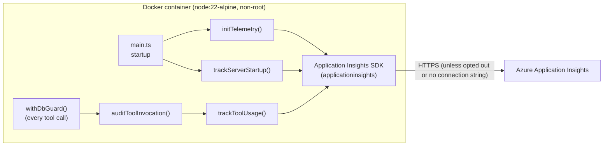

# Container Deployment & Application Insights Telemetry — Design Doc

## 1. Overview

This document describes two related capabilities added to the DocumentDB MCP Server:

1. **Containerization** — a production-oriented, multi-stage `Dockerfile` that packages the
   server as a small, non-root image running the network (`streamable-http`) transport.
2. **Application Insights telemetry** — an **opt-out**, privacy-preserving telemetry layer that
   emits **install/activation counts** and **MCP tool-usage** signals to Azure Application
   Insights.

The primary purpose of telemetry is to **measure adoption and feature usage**, so it is **enabled
by default** and operators explicitly **opt out** when they do not want it. Data is only actually
transmitted when a connection string is available (embedded in official published builds, or
supplied at runtime); a source build with no connection string is a silent no-op. Opting out
(`APPINSIGHTS_ENABLED=false`) disables collection entirely, regardless of any connection string.

### Goals

- Ship a reproducible, minimal, hardened container image for the MCP server.
- **Measure adoption** ("how many installs / activations") and **feature usage** ("which tools are
  used, how often, allowed vs denied") by default, so the data is representative rather than biased
  toward the small subset of users who would opt in.
- Give operators a clear, single, well-documented **opt-out** switch.
- Never collect sensitive data (queries, documents, credentials, connection strings).
- Keep the Application Insights connection string **out of the public repository**.

### Non-Goals

- Per-user behavioral analytics or PII collection.
- Shipping query payloads, filters, document contents, or backend hostnames/credentials.
- Making telemetry mandatory — a single documented opt-out (`APPINSIGHTS_ENABLED=false`) must
  fully disable collection.

## 2. Architecture



Telemetry is wired into two existing chokepoints so no per-tool code changes are required:

- **Startup** — [src/main.ts](../src/main.ts) calls `initTelemetry()` then `trackServerStartup()`
  once per process/container start.
- **Tool usage** — [src/security/audit.ts](../src/security/audit.ts) already receives every
  allow/deny decision via `auditToolInvocation()`. It mirrors that decision to
  `trackToolUsage()`, so all transports (stdio / streamable-http / sse) are covered uniformly.
- **Shutdown** — [src/server.ts](../src/server.ts) calls `flushTelemetry()` in each transport's
  cleanup handler so buffered events are not lost on graceful exit.

The implementation lives in [src/telemetry.ts](../src/telemetry.ts) and is intentionally thin.

## 3. Configuration

Telemetry configuration is added to the central config in [src/config.ts](../src/config.ts) under
`config.telemetry`:

| Env var | Default | Purpose |
| --- | --- | --- |
| `APPINSIGHTS_ENABLED` | `true` | **Opt-out switch.** Telemetry is on by default; set to `false` to fully disable collection (no client is created, no events are sent). |
| `APPLICATIONINSIGHTS_CONNECTION_STRING` | *(embedded in official builds; otherwise empty)* | Azure App Insights connection string. Official published images embed it so telemetry works out-of-the-box; source builds with no value simply have nothing to send. |
| `APPINSIGHTS_CLOUD_ROLE` | `documentdb-mcp-server` | Cloud role name used to identify this component in App Insights. |

Telemetry actually **transmits** only when it is not opted out (`APPINSIGHTS_ENABLED` is truthy)
**and** a non-empty connection string is available. Because the connection string is embedded in
official published builds, those images collect by default; operators disable collection with the
single `APPINSIGHTS_ENABLED=false` opt-out. If no connection string is present (e.g. a local build
from source), `initTelemetry()` logs a single line to stderr and every telemetry helper becomes a
silent no-op.

### 3.1 Opting out

Collection is disabled with a single, documented switch:

```bash
# Docker
docker run -e APPINSIGHTS_ENABLED=false ... documentdb-mcp

# or in any environment
export APPINSIGHTS_ENABLED=false
```

When opted out, `initTelemetry()` never constructs an Application Insights client, so no events,
metrics, or auto-collected signals leave the process. This is honored identically across all
transports (stdio / streamable-http / sse).

### 3.2 Keeping the connection string out of the public repo

This is a **public repository**, so the connection string is treated as a secret and is **never
committed**. The design enforces this by construction:

- The connection string is **only** read from the `APPLICATIONINSIGHTS_CONNECTION_STRING`
  environment variable (or an equivalent secret injected at build/publish time) — it is never
  hard-coded in source.
- **Official published images** embed the connection string at publish time via a **CI secret**
  (e.g. a GitHub Actions secret passed as a build arg / baked into the runtime environment). The
  secret lives in the CI/CD system, **not** in the repository. This is what enables opt-out
  collection to work out-of-the-box for the distributed image.
- [.env.example](../.env.example) ships the variable **commented out** with a placeholder value,
  so contributors see the knob without a real value being present.
- `.env` (the real, local values) is excluded from the image via [.dockerignore](../.dockerignore)
  and from git via `.gitignore`, so it cannot be accidentally baked into the image or pushed.
- The `Dockerfile` does **not** hard-code the value. For local/self builds it is injected at run
  time only, e.g.:

  ```bash
  docker run -p 8070:8070 \
    -e APPLICATIONINSIGHTS_CONNECTION_STRING="InstrumentationKey=...;IngestionEndpoint=..." \
    -e CONNECTION_PROFILES='{...}' \
    documentdb-mcp
  ```

- In Azure (ACA / AKS / App Service), inject it as a **secret** / Key Vault reference rather than a
  plain environment variable in source-controlled manifests.

**Rule of thumb:** the connection string enters the system only through a CI/CD secret or runtime
environment / secret injection. If you ever see it in a source file, a committed `.env`, or a
hard-coded Dockerfile `ENV`, that is a bug.

## 4. What We Collect

Telemetry is limited to **coarse operational signals**. The full, exhaustive list of what is sent:

### 4.1 Startup / install signal — `trackServerStartup()`

Emitted once per process/container activation. Used to count "installs" (distinct activations).

| Signal | Type | Dimensions |
| --- | --- | --- |
| `ServerStartup` | custom event | `transport` (stdio/streamable-http/sse), `version`, `cloudRole` |
| `Installs` | custom metric (`value: 1`) | `transport`, `version` |

### 4.2 Tool usage signal — `trackToolUsage()`

Emitted once per MCP tool invocation (both allowed and denied calls).

| Signal | Type | Dimensions |
| --- | --- | --- |
| `ToolInvocation` | custom event | `toolName`, `requiredRole` (read/write/management), `decision` (allow/deny), `connectionProfile` *(name only)*, `transport`, and `reason` *(only on deny)* |
| `ToolUsage` | custom metric (`value: 1`) | `toolName`, `decision`, `requiredRole` |

### 4.3 SDK auto-collected signals

The App Insights SDK is configured (in [src/telemetry.ts](../src/telemetry.ts)) to auto-collect
standard operational health signals for the process:

- Incoming HTTP requests (for HTTP/SSE transports), performance counters (CPU/memory),
  unhandled exceptions, and outbound dependency calls, with dependency correlation.
- **Console log auto-collection is explicitly disabled** (`setAutoCollectConsole(false)`) so the
  structured `[MCP-AUDIT]` / stderr logs are **not** shipped to App Insights.
- Live Metrics is disabled (`setSendLiveMetrics(false)`).

## 5. What We Do NOT Collect

By design, the following are **never** sent to Application Insights:

- **Query filters, projections, aggregation pipelines, or update/patch bodies.**
- **Document contents** or any returned data.
- **Credentials, tokens, or connection strings.**
- **Backend hostnames, database endpoints,** or connection-profile *contents* (only the profile
  **name** — an operator-defined label — is sent as a dimension).
- **Database or collection names** are not included in telemetry dimensions.
- **Principal identity / PII** (oid, sub, upn, name). These appear only in local audit logs, which
  are not forwarded to App Insights.

The `reason` string is attached **only** to denied calls to aid diagnostics, and contains the
server-generated policy message (e.g. "capability disabled", "connection_profile required"), never
user payload data.

## 6. Privacy & Safety Properties

- **Opt-out, honored fully:** setting `APPINSIGHTS_ENABLED=false` prevents any client from being
  created ⇒ no events, metrics, or auto-collected signals leave the process.
- **No connection string ⇒ no network calls:** a build with no embedded/injected connection string
  is a silent no-op even with telemetry enabled.
- **Fail-safe:** telemetry init and every emit are wrapped in try/catch. A telemetry failure logs
  to stderr and is swallowed — it can never crash or block a tool call or server startup.
- **Lazy loading:** the `applicationinsights` module is required via a computed specifier only when
  telemetry is enabled, so it is not pulled into test/bundler module graphs and adds no cost when
  disabled.
- **Least data:** only enumerated, non-sensitive dimensions are emitted (see §4/§5).
- **Auditability:** the same allow/deny decisions are also written to local `[MCP-AUDIT]` logs, so
  operators can independently verify what telemetry would contain.
- **Discoverability of the opt-out:** the opt-out switch is documented in the README and
  [.env.example](../.env.example) so operators can find and set it easily.

## 7. Dockerfile Design

The image is defined in [Dockerfile](../Dockerfile) as a **multi-stage** build.

### 7.1 Stages

- **`build` stage** (`node:22-alpine`):
  - Installs **production dependencies only** (`--omit=dev`, `--no-package-lock`), then adds a
    minimal, **unsaved** TypeScript toolchain (`typescript`, `@types/node`, `@types/express`) to
    compile, and finally `npm prune --omit=dev` to strip that toolchain back out.
  - Runs `npm run build` explicitly (with `--ignore-scripts` on installs so the `prepare` lifecycle
    hook does not fire before sources are present).
- **`runtime` stage** (`node:22-alpine`):
  - Copies only pruned `node_modules` and compiled `dist/` from the build stage — no dev toolchain,
    no TypeScript sources.
  - Runs as the built-in unprivileged `node` user.
  - Defaults to `TRANSPORT=streamable-http`, `HOST=0.0.0.0`, `PORT=8070`, and exposes `8070`.
  - Defines a `HEALTHCHECK` that probes the unauthenticated `/healthz` route.

### 7.2 Base image: Node 22

The base image is `node:22-alpine` (not 20) because the Application Insights v3 SDK pulls in
`@azure/monitor-opentelemetry-exporter`, which requires Node ≥ 22. Node 22 still satisfies the
project's `engines: >=20`.

### 7.3 Build hardening / footguns addressed

Several non-obvious build issues were designed around and are documented inline in the Dockerfile:

| Problem observed | Root cause | Mitigation in Dockerfile |
| --- | --- | --- |
| `sh: tsc: not found` | The `prepare` npm lifecycle hook runs `npm run build` during install, before `tsconfig.json`/`src` exist and without the dev toolchain. | `--ignore-scripts` on all installs; build invoked explicitly after sources are copied. |
| `npm error Exit handler never called!` | `npm ci` reconstructs the **full** lockfile tree (incl. heavy vitest 4 wasm test binaries `@rolldown/binding-wasm32-wasi` / `@napi-rs/wasm-runtime`), exhausting container memory. | Prod-only, lockfile-free install so the dev/test tree is never resolved; `NODE_OPTIONS=--max-old-space-size=2048` for headroom. |
| Transient `ERR_SSL...HANDSHAKE_FAILURE` to `registry.npmjs.org` | Slow/flaky registry access behind proxies. | npm fetch retry/backoff env vars (`npm_config_fetch_retries`, etc.). |

### 7.4 `.dockerignore`

[.dockerignore](../.dockerignore) keeps the build context and image lean and secret-free by
excluding `node_modules`, `dist`, tests, docs, scripts, and **all `.env*` files except
`.env.example`**.

## 8. Operational Notes

- **Health probes:** `/healthz` (liveness) and `/readyz` (readiness) are unauthenticated and are
  used by the container `HEALTHCHECK` and by orchestrators (K8s/ACA).
- **Verifying telemetry:** in Application Insights, chart the `Installs` metric (or `ServerStartup`
  event) for activations, and the `ToolUsage` metric / `ToolInvocation` event (sliced by
  `toolName` / `decision`) for feature usage.
- **Opting out:** set `APPINSIGHTS_ENABLED=false`. This is the single, documented switch that
  fully disables collection. (A source build with no connection string also collects nothing.)

## 9. Future Considerations

- Add a sampling rate control for very high-volume deployments.
- Consider a first-run/first-activation dedupe if "installs" needs to mean unique deployments
  rather than process activations.
- Surface a clear **first-run telemetry notice** (printed to stderr on startup) stating that
  anonymous usage telemetry is enabled and how to opt out, so the opt-out is transparent.
- Consider honoring the community `DO_NOT_TRACK` environment variable as an additional opt-out
  signal alongside `APPINSIGHTS_ENABLED=false`.
