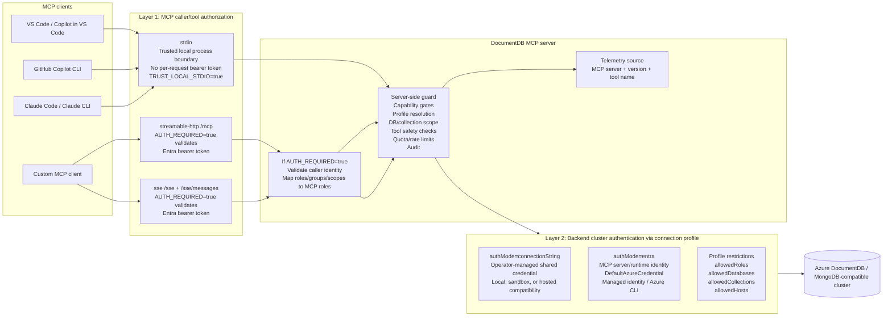

# DocumentDB MCP Server Design Review Notes

## 1. Overview

DocumentDB MCP Server is a Model Context Protocol server built for DocumentDB, allowing MCP clients or AI agents to access Azure DocumentDB / MongoDB-compatible DocumentDB in a controlled way. It exposes common database, collection, index, and document operations as MCP tools that can be invoked by VS Code agent, Copilot, Claude Desktop, Claude Code, Claude CLI, or custom MCP clients. The server's core responsibility is to provide a tool execution entry point and apply authentication, authorization, connection configuration, and safety controls on the server side.

The design supports two deployment models:

- **Local personal MCP server**: a single user runs the MCP server as a local `stdio` child process from a trusted desktop client. This is the common MCP quickstart model. The user can configure one connection-string profile and, when supported by configuration, use it as a default profile so normal tool calls do not need to repeat profile selection.
- **Enterprise hosted MCP server**: an organization hosts a shared MCP endpoint over `streamable-http` or `sse`. This model requires stronger server-side controls: Entra authentication at the MCP endpoint, MCP role mapping, profile-level backend restrictions, audit logging, and quota/rate limiting.

Database tools are stateless. They use an administrator-defined connection profile, either explicitly through `connection_profile` or through a local default profile. Tools do not accept raw runtime database connection strings from the AI agent.

At a high level, the MCP server sits between the developer's MCP client and the external DocumentDB cluster. The client decides what tool to call, but the server owns two separate auth boundaries. The first boundary is MCP caller/tool authorization, controlled by `AUTH_REQUIRED` for HTTP/SSE and by the trusted local process boundary for stdio. The second boundary is backend cluster authentication, controlled by the selected connection profile's `authMode` (`connectionString` or `entra`). After those checks, the server applies capability gates, profile scope, operation-level restrictions, quota/rate limits, and only then opens a database connection.



The main workflow is: the agent sends an MCP tool call with parameters such as `connection_profile`, `db_name`, `collection_name`, query, or mutation payload; the server evaluates the request against its caller-auth, capability, profile, and operation controls; allowed requests are executed against the external cluster using the profile's configured backend auth mode; denied requests are rejected and audited before a database connection is opened.

## 2. Features

### Tools And Capability Levels

The server currently exposes 18 tools across three risk levels: `read`, `write`, and `management`.

| Category | Tool | Level | Description |
| --- | --- | --- | --- |
| Database | `list_databases` | read | List databases, or list collections and estimated counts for one database. |
| Database | `drop_database` | management | Drop a database and all collections; requires `confirm_db_name`. |
| Collection | `sample_documents` | read | Return sample documents from a collection. |
| Collection | `get_statistics` | read | Return database, collection, or index statistics. |
| Collection | `drop_collection` | management | Drop a collection; requires `confirm_collection_name`. |
| Collection | `rename_collection` | management | Rename a collection with `dropTarget: false`. |
| Collection | `current_ops` | management | Return current MongoDB operations. |
| Index | `list_indexes` | read | List indexes for a collection. |
| Index | `create_index` | management | Create an index. |
| Index | `drop_index` | management | Drop an index; requires `confirm_index_name`. |
| Document | `find_documents` | read | Find documents with query and consolidated options. |
| Document | `count_documents` | read | Count documents matching a query. |
| Document | `aggregate` | read | Run an aggregation pipeline; `$out` and `$merge` are disabled by default. |
| Document | `explain_operation` | read | Explain find, count, or aggregate with execution stats. |
| Document | `insert_documents` | write | Insert one or more documents. |
| Document | `update_documents` | write | Update one or many documents. |
| Document | `delete_documents` | write | Delete one or many documents. |
| Document | `find_and_modify` | write | Atomically find and update one document. |

Level semantics:

- `read`: query and retrieval operations.
- `write`: document-level mutations such as insert, update, and delete; includes read access.
- `management`: higher-impact operations such as database, collection, index, and operational management; includes write and read access.

Some tools intentionally do not map one-to-one with native MongoDB APIs. This is by design: the MCP tool surface is compressed to reduce the number of tools exposed to AI agents and to avoid confusing tool selection. When a tool combines multiple related operations, the exact behavior is controlled by explicit input parameters, so the server can keep a smaller tool surface without making the operation ambiguous.

Examples:

- `list_databases` covers both list-database and database-info scenarios. Without `db_name`, it lists databases; with `db_name`, it returns collections and estimated counts for that database.
- `insert_documents` supports both single-document and multi-document insert through one tool.
- `update_documents` and `delete_documents` use `multi` parameter to cover one/many behavior.
- `get_statistics` unifies database, collection, and index statistics through `scope`.

The benefit is that the AI agent sees fewer, higher-level, less ambiguous tools, reducing accidental misuse caused by selecting the wrong low-level MongoDB API wrapper.

### Supported MCP Transports

The server supports three MCP transport modes. They expose the same tool surface and the same backend connection profile model, but differ in the first auth boundary: how the caller is authenticated to the MCP endpoint.

| Transport | Endpoint / Mode | Layer 1: MCP caller/tool auth (`AUTH_REQUIRED`) | Layer 2: backend cluster auth (`authMode`) | Difference | Recommended scenario |
| --- | --- | --- | --- | --- | --- |
| `stdio` | Local child process launched by an MCP client | No per-request bearer token. `AUTH_REQUIRED` token validation is not available because there is no HTTP request/header. Use the trusted local process boundary with `TRUST_LOCAL_STDIO=true`. | Same as other transports: profiles may use `authMode=connectionString` or `authMode=entra`. | No HTTP endpoint. The MCP client talks to the server through standard input/output. It is simple and convenient, but has no per-request HTTP bearer-token boundary. | Local development, demos, and single-user trusted desktop usage. |
| `streamable-http` | `POST /mcp` with MCP session support | Entra bearer token when `AUTH_REQUIRED=true` (recommended). `AUTH_REQUIRED=false` disables only this caller-auth layer for local/dev testing. | Same as other transports: profiles may use `authMode=connectionString` or `authMode=entra`. | HTTP-based transport with request middleware, rate limiting, Entra bearer token validation, and session handling. | Recommended for shared, remote, or production-style deployments. |
| `sse` | `GET /sse` and `POST /sse/messages` | Same as streamable HTTP: Entra bearer token when `AUTH_REQUIRED=true`; local/dev auth bypass only when explicitly configured. | Same as other transports: profiles may use `authMode=connectionString` or `authMode=entra`. | Server-Sent Events transport for clients that still rely on the older SSE MCP pattern. It uses the same HTTP authentication and rate-limit middleware as HTTP. | Compatibility with MCP clients that do not yet support streamable HTTP. |

In short: use `stdio` for trusted local personal usage, use `streamable-http` as the preferred enterprise hosted transport, and use `sse` only when client compatibility requires it.

There are two separate authentication decisions, and they should not be conflated:

- **MCP endpoint authentication** controls who can call the MCP server and which MCP tool tier they can use. For local `stdio`, this is the trusted local process boundary; stdio does not support the HTTP bearer-token model. For HTTP/SSE, `AUTH_REQUIRED=true` enables Entra bearer-token validation and MCP role mapping. `AUTH_REQUIRED=false` disables only this first layer.
- **Backend database authentication** controls how the MCP server connects to DocumentDB or a MongoDB-compatible cluster. This is independent of transport and `AUTH_REQUIRED`. Every transport can use profiles with `authMode=connectionString` or `authMode=entra`. In `authMode=entra`, the server uses its runtime identity through Azure Identity / MongoDB OIDC for the profile's configured endpoint; it does not reuse the incoming MCP caller token and cannot connect to clusters not defined in profiles.

## 3. Security Design

### Security Concern Without Server-Side Restrictions

If an MCP server simply exposes MongoDB driver operations without strong server-side restrictions, customers face a meaningful security concern.

Customers may deploy an open-source or standalone Azure DocumentDB MCP server package in their own environment and connect MCP clients, including AI agents such as VS Code agent, to it. The MCP server exposes tools in multiple categories:

- read/query operations,
- document write operations such as insert, update, and delete,
- database, collection, index management operations, and other management-plane-like actions.

Once configured, the MCP client can use these tools to interact with the underlying database in many ways, potentially executing management-plane-like actions under the user context. If the primary protection relies only on the database access rights assigned to the user, that is insufficient when actions are mediated by an AI agent.

The non-guarded approach has several weaknesses:

- **Insufficient server-enforced authorization boundaries across capability tiers**: without MCP-level authorization, read/write/management boundaries depend only on external database permissions that the MCP server does not control.
- **Over-reliance on client or framework confirmation prompts**: the design may assume that the MCP client asks for confirmation before execution, but most MCP clients cannot be assumed to do this consistently.
- **Connection-string credential path weakens per-user authorization at the MCP boundary**: if a shared connection string is used, the MCP server may be unable to perform reliable per-user backend authorization or attribution.
- **Accountability and attribution gap**: actions can appear as if performed by the user even when triggered by an agent, making it difficult to prove that the user intentionally approved the action.

Because of these weaknesses, a legitimate user may send a prompt that is misunderstood by an AI agent. The agent may then invoke tools that perform unwanted and possibly dangerous actions, including modifying documents, collections, indexes, or DocumentDB instances. Since the operations run through a valid security context and the MCP server cannot rely on client-side confirmations, impactful operations may execute without a reliably enforceable human-in-the-loop gate at the server boundary.

Potential losses include:

- **Availability / integrity loss**: unintended deletion or modification of important documents, collections, and indexes.
- **Financial impact**: unintended resource deployment or configuration changes that carry cost, with ambiguity over responsibility.
- **Compliance / privacy exposure**: even read-only access can be problematic in regulated environments if the agent accesses records without business need.
- **Incident-response ambiguity**: difficulty distinguishing AI-initiated actions from explicit user intent.

This risk arises from design choices and unsafe defaults, can lead to high-impact customer harm, has customer-wide blast radius, and over-relies on external systems such as MCP clients, framework confirmations, and user intent.

### Current Mitigations In This MCP Server

#### Entra ID Authentication For HTTP / SSE

For HTTP and SSE transports, the server validates Entra bearer tokens when `AUTH_REQUIRED=true` (by default).

Implementation details:

- Reads `Authorization: Bearer <token>` from the incoming request.
- Validates JWT signature with Entra tenant JWKS using `jose`.
- Validates issuer and audience using `ENTRA_TENANT_ID` and `ENTRA_AUDIENCE` / `ENTRA_CLIENT_ID`.
- Extracts caller identity and claims into request context: `oid`, `sub`, `tid`, `upn`, `name`, `roles`, `groups`, and `scp`.
- Authorization and audit logging read identity from this request context.

Why this helps:

- The MCP server can identify who is invoking tools.
- Customers can control access to the MCP endpoint using standard organizational identity controls.
- The server can make tool-level authorization decisions instead of treating all callers as equivalent.

#### Granular Role-Based Authorization

Each tool declares a required level: `read`, `write`, or `management`. The server maps token claim values from `roles`, `groups`, or `scp` to MCP roles using these environment variables:

```env
MCP_READ_ROLE_VALUES=DocumentDB.MCP.Read
MCP_WRITE_ROLE_VALUES=DocumentDB.MCP.Write
MCP_MANAGEMENT_ROLE_VALUES=DocumentDB.MCP.Management
```

Role hierarchy:

```text
management > write > read
```

Why this helps:

- Read-only users can be prevented from invoking mutation or management tools through MCP.
- Write users can modify documents without automatically getting collection/index/database management capabilities.
- Management actions are separated because they carry materially higher risk.

#### Global Capability Gates

The server has deployment-level capability flags:

```env
ENABLE_READ_TOOLS=true
ENABLE_WRITE_TOOLS=false
ENABLE_MANAGEMENT_TOOLS=false
```

Write and management tools are disabled by default even if code for those tools exists. Operators must explicitly opt in.

Why this helps:

- A fresh deployment exposes only read tools by default.
- A broad Entra role assignment alone cannot accidentally enable write or management tools.
- Customers must make an explicit risk decision before enabling higher-impact capabilities.

#### Administrator-Defined Connection Profiles

Every tool uses a connection profile. In enterprise HTTP/SSE usage, tools should provide an explicit `connection_profile`. In trusted local stdio usage, a configured default profile can supply the profile implicitly. Tools do not accept runtime database connection strings from the AI agent or end user.

Profiles are configured by the MCP server administrator through `CONNECTION_PROFILES` or `CONNECTION_PROFILES_FILE`. Production profiles should use `authMode=entra` with MongoDB OIDC and Azure Identity. Connection-string profiles are still supported for local or sandbox use, but they are constrained to administrator-defined profiles rather than being supplied dynamically by the agent.

Why this helps:

- Agents cannot introduce unreviewed credentials at runtime.
- Database connectivity remains under organizational control.
- Customers can document and review the risk of any connection-string profile explicitly.
- Local users can still get a one-config connection-string quickstart without exposing arbitrary runtime credentials to tool calls.

#### Quota And Rate Limiting

HTTP and SSE transports use request middleware for rate limiting before requests reach the MCP tool layer. The default deployment-level settings are:

```env
RATE_LIMIT_ENABLED=true
RATE_LIMIT_WINDOW_MS=60000
RATE_LIMIT_MAX_REQUESTS=120
```

This protects shared endpoints from accidental high-frequency agent loops and gives operators a coarse quota control for hosted deployments. Tool-specific limits provide an additional layer after authorization, including maximum find/sample sizes, insert batch size, response bytes, and MongoDB `maxTimeMS`.

Future enterprise quota policies can be layered on the same enforcement point, for example per-caller, per-role, per-profile, or per-tool budgets. The current design already records caller identity, transport, profile, and tool name in audit events so those quota dimensions are observable.

#### Profile-Level Capability And Resource Restrictions

Connection profiles can further restrict what the profile allows:

```json
{
  "prod-read": {
    "authMode": "entra",
    "endpoint": "prod.mongocluster.cosmos.azure.com",
    "tokenScope": "https://ossrdbms-aad.database.windows.net/.default",
    "allowedHosts": ["*.mongocluster.cosmos.azure.com"],
    "allowedRoles": ["read"],
    "allowedDatabases": ["fleet"],
    "allowedCollections": {
      "fleet": ["vehicles", "maintenance"]
    }
  }
}
```

Important semantics:

- `allowedRoles` omitted means read-only by default.
- `allowedRoles: []` means deny-all.
- `allowedDatabases` omitted means all databases; `[]` means deny-all.
- `allowedCollections[db]` omitted means all collections in that database; `[]` means deny-all for that database.

Why this helps:

- Even if global write tools are enabled, a production profile can remain read-only.
- A profile can be scoped to specific databases and collections.
- Compared with global capability flags, profile-level restrictions allow one MCP server instance on the same machine to serve multiple applications, environments, or workflows with different scopes. For example, one app can use `prod-read` for production read-only investigation while another app uses `sandbox-write` for test data mutation, without giving both apps the same backend scope.
- `list_databases` filters results based on profile scope, reducing unintended enumeration.

#### Tool-Specific Safety Controls

The server adds controls beyond role checks:

- Destructive operations require confirmation fields: `confirm_db_name`, `confirm_collection_name`, `confirm_index_name`.
- `aggregate` and `explain_operation` reject `$out` and `$merge` by default unless `ALLOW_AGGREGATE_WRITE_STAGES=true`.
- Query size and runtime are bounded with `MAX_FIND_LIMIT`, `MAX_SAMPLE_SIZE`, `MAX_INSERT_BATCH_SIZE`, `MAX_RETURN_BYTES`, and `MONGODB_MAX_TIME_MS`.
- All tool responses pass through `serializeResponse` to enforce a response-size cap.

Why this helps:

- Destructive operations require explicit target confirmation at the server side.
- Aggregation cannot silently become a write path by default.
- A malformed or overly broad agent request is less likely to overload the backend or flood the LLM context.

This is not redundant with authentication, RBAC, or profile-level checks. Those earlier gates answer **who** can call a tool and **which backend/resource scope** the tool may target. Tool-specific controls answer whether this particular operation is safe enough to execute after authorization has already passed, such as whether a destructive target was explicitly confirmed, whether an aggregation contains write stages, or whether the requested result size is too large.

#### Server-Side Guard Cases

All database tools are wrapped by `withDbGuard`, which applies the same enforcement path before opening a database connection. The important point is that authorization, profile resolution, resource scoping, tool-specific checks, and audit logging are enforced on the server side rather than delegated to the MCP client.

Example:

- A caller with `DocumentDB.MCP.Read` invokes `find_documents` against `connection_profile=prod-read`, `db_name=fleet`, and `collection_name=vehicles`. If read tools are enabled and the profile allows `read` plus `fleet.vehicles`, the request passes server-side guard checks and reaches the backend.
- The same caller invokes `insert_documents`. If `ENABLE_WRITE_TOOLS=false`, the request is denied at `Global capability enabled?`. If write tools are globally enabled but `prod-read.allowedRoles=["read"]`, the request is denied at `Profile allows required level?`.
- The same caller invokes `find_documents` against `db_name=payroll`. If `payroll` is not in `allowedDatabases`, the request is denied at `Profile allows target db/collection?` before any database connection is opened.

#### Audit And Attribution

Allowed and denied invocations are logged to stderr with the `[MCP-AUDIT]` prefix. Audit events include tool name, required role, allow/deny decision, denial reason, connection profile, transport, session ID or request ID, and caller metadata such as `oid`, `sub`, `tid`, `upn`, and `name`.

Why this helps:

- Denied actions are explainable.
- Allowed actions are attributable to the caller identity available at the MCP boundary.
- Incident response has MCP-level evidence rather than only backend database logs.

#### Tool And Version Usage Tracking

Backend connections include MCP source information so server-side metrics can distinguish MCP-originated traffic from other database clients. The driver application name/user-agent style value includes:

- MCP server name.
- MCP server version.
- MCP tool name, such as `find_documents`, `aggregate`, or `insert_documents`.
- Optional profile-level application name as an operator-defined prefix.

Example value:

```text
documentdb-mcp-server/0.1.0 tool/find_documents
```

Why this helps:

- Backend metrics can separate VS Code/Copilot/Claude MCP traffic from regular application traffic.
- Service-side usage can be grouped by tool to understand which MCP operations are used most often.
- Version tagging helps identify behavior changes during rollout or support investigations.

### Auth Scenarios

The MCP server's auth model is not meant to replace DocumentDB database permissions. It adds a server-side business safety boundary for AI-agent-mediated operations. This matters because a person may legitimately have broad or even admin-level access to a DocumentDB cluster, while the MCP workflow they are performing should still be constrained to a narrower task scope.

#### Scenario 1: Production Admin Doing Read-Only Investigation

A database administrator may already have broad admin permissions on the production DocumentDB cluster. However, when the administrator connects through the MCP server for an AI-assisted incident investigation, the organization can assign only `DocumentDB.MCP.Read` to that user and require the `prod-read` connection profile.

In this scenario:

- The user can ask the agent to inspect collections, sample documents, count records, or run bounded queries.
- If the agent misunderstands a prompt such as "clean up stale vehicle records" and tries to call `delete_documents`, the call is denied because the caller does not have the MCP write role and the production profile is read-only.
- If the agent tries a management operation such as `drop_collection`, it is also denied by MCP role checks, global capability gates, profile-level restrictions, and destructive-operation confirmation requirements.

Business value: the user can keep their normal operational access outside MCP, while the AI-assisted workflow is constrained to investigation-only behavior. This reduces the chance that an ambiguous prompt turns into production data loss.

#### Scenario 2: Separate Break-Glass Management Access

Management tools such as `drop_database`, `drop_collection`, `create_index`, and `drop_index` are higher-risk than ordinary reads or document writes. Even if some operators are trusted administrators, the MCP server can require a separate `DocumentDB.MCP.Management` role and explicit enablement through `ENABLE_MANAGEMENT_TOOLS=true`.

In this scenario:

- Day-to-day users receive read or write roles, but not management.
- A small operator group receives management only for planned maintenance or break-glass workflows.
- Destructive tools still require confirmation parameters such as `confirm_db_name`, `confirm_collection_name`, or `confirm_index_name`.

Business value: management operations are separated from normal AI-assisted usage, making high-impact actions more intentional, auditable, and easier to govern.

#### Scenario 3: Multiple Applications With Different Scopes

One MCP server instance can serve multiple applications or workflows on the same machine by using different connection profiles. For example, a production support assistant can use `prod-read`, while a validation assistant uses `sandbox-write`.

In this scenario:

- The support assistant can query production data but cannot mutate it.
- The validation assistant can insert or update sandbox data but cannot access production collections.
- The same tool name, such as `find_documents` or `insert_documents`, is evaluated against the selected `connection_profile` on every call.

Business value: teams do not need to run a separate MCP server for every workflow just to enforce different scopes. The profile layer provides task-specific isolation on top of global server configuration.

#### Scenario 4: Local Stdio Clients With Trusted Process Boundary

Agent-integrated terminals (VS Code, GitHub Copilot CLI, Claude Code, and Claude CLI, etc.) commonly launch MCP servers as local child processes over `stdio`. In this mode, the client and server communicate through stdin/stdout, not HTTP. There is no HTTP request and therefore no `Authorization: Bearer <token>` header for the MCP server to validate.

The local stdio configuration is:

```env
TRANSPORT=stdio
AUTH_REQUIRED=false
TRUST_LOCAL_STDIO=true
```

Expected flow:

1. The user adds the DocumentDB MCP server to the local MCP client configuration. This can be VS Code MCP settings, GitHub Copilot CLI MCP config, Claude Code, Claude CLI, or Claude Desktop.
2. The client starts `npx -y github:microsoft/documentdb-mcp` as a local child process with `TRANSPORT=stdio`.
3. The MCP server trusts the local process boundary instead of validating a per-request Entra bearer token.
4. The config provides one or more administrator-defined connection profiles, for example a local connection-string profile or an Entra/OIDC backend profile.
5. The agent invokes tools over stdio. The server still resolves the configured profile, applies global capability gates, profile restrictions, quota/rate limits, and tool-specific safety checks before opening the backend connection.

This scenario is the local quickstart model. It is different from enterprise access control because it does not provide per-request organizational identity at the MCP boundary. Product sign-in state, such as GitHub Copilot sign-in or Claude account sign-in, is between the user and that client product; it is not forwarded to this MCP server as a bearer token over stdio.

Backend cluster authentication remains independent from this local caller-auth model. A stdio-launched server can connect to the backend using either connection mode:

```env
CONNECTION_PROFILES={"local":{"authMode":"connectionString","uri":"mongodb://localhost:27017"}}
```

or:

```env
CONNECTION_PROFILES={"prod-read":{"authMode":"entra","endpoint":"prod.mongocluster.cosmos.azure.com","tokenScope":"https://ossrdbms-aad.database.windows.net/.default"}}
```

Business value: developers can run simple local demos without setting up an Entra-protected MCP endpoint, while still keeping profile scope, global capability gates, and tool-specific protections in force.

#### Scenario 5: Enterprise Hosted MCP Endpoint

In the enterprise hosted model, clients do not launch a local child process. Instead, they call a shared `streamable-http` or `sse` endpoint operated by the organization.

Expected flow:

1. The organization registers the MCP server as an Entra-protected application/API.
2. Users or groups are assigned app roles such as `DocumentDB.MCP.Read`, `DocumentDB.MCP.Write`, or `DocumentDB.MCP.Management`.
3. The MCP client obtains an Entra access token for the MCP server audience and sends it as `Authorization: Bearer <token>`.
4. The MCP server validates issuer, audience, signature, and expiry, then maps claims to MCP roles.
5. The server applies global capability gates, profile restrictions, quota/rate limits, and tool-specific safety checks.
6. The backend connection is opened using the selected profile. The profile can use `authMode=connectionString` for clusters that do not support Entra/OIDC, or `authMode=entra` with managed identity/workload identity when available.

This is the model intended for organizational sharing, centralized audit, per-user attribution, and server-side usage tracking.

## 4. Usage Flow

### Step 1: Download And Build The Package

Run from source:

```bash
git clone https://github.com/microsoft/documentdb-mcp.git
cd documentdb-mcp
npm install
npm run build
```

Or run directly from GitHub with `npx` in an MCP client config:

```bash
npx -y github:microsoft/documentdb-mcp
```

### Step 2: Choose Transport

For local personal usage with common desktop/CLI MCP clients:

```env
TRANSPORT=stdio
AUTH_REQUIRED=false
TRUST_LOCAL_STDIO=true
```

For shared or production-style deployment:

```env
TRANSPORT=streamable-http
HOST=localhost
PORT=8070
AUTH_REQUIRED=true
```

### Step 3: Configure Entra Application And Service Principal

For enterprise HTTP/SSE transports, the MCP server should be represented as an Entra-protected API/application. Local stdio quickstarts do not require this step because there is no HTTP bearer-token boundary.

The two Entra objects involved are:

- **Application / App Registration**: the global application definition. This is where the MCP server audience, app roles, and API permissions are defined.
- **Service Principal / Enterprise Application**: the tenant-local instance of that application. This is where users or groups are assigned to the app roles.

Recommended setup flow:

1. Create or use an Entra App Registration for the DocumentDB MCP server.
2. Use the Application client ID or configured API audience as the token audience.
3. Make sure a Service Principal exists for this application in the tenant. In the Azure portal, this appears under Enterprise Applications.
4. Configure the MCP server with the tenant and audience values:

```env
ENTRA_TENANT_ID=<tenant-id>
ENTRA_AUDIENCE=<application-client-id-or-api-audience>
```

The MCP client must send an Entra bearer token for this audience when calling HTTP/SSE endpoints. After role assignment, the issued token should contain role values in the `roles` claim.

### Step 4: Create And Assign MCP Roles

Create app roles on the Entra Application / App Registration. The role `value` fields should match the values that the MCP server expects:

| Entra app role value | MCP level | Intended users |
| --- | --- | --- |
| `DocumentDB.MCP.Read` | read | Users who can inspect/query data. |
| `DocumentDB.MCP.Write` | write | Users allowed to mutate documents. |
| `DocumentDB.MCP.Management` | management | Operators allowed to manage databases, collections, indexes, and operations. |

Then assign users or groups to these roles on the Service Principal / Enterprise Application. This assignment step is important: defining roles on the App Registration only declares what roles exist; assigning roles on the Service Principal controls who actually receives those roles in tokens.

Define role values in the MCP server environment:

```env
MCP_READ_ROLE_VALUES=DocumentDB.MCP.Read
MCP_WRITE_ROLE_VALUES=DocumentDB.MCP.Write
MCP_MANAGEMENT_ROLE_VALUES=DocumentDB.MCP.Management
```

At runtime, the MCP server reads role values from token claims and maps them to MCP capability levels. For example, a caller assigned `DocumentDB.MCP.Read` can invoke read tools, but cannot invoke write or management tools unless the token also contains the corresponding higher-level role.

### Step 5: Enable Tool Capability Tiers

Start with read-only defaults:

```env
ENABLE_READ_TOOLS=true
ENABLE_WRITE_TOOLS=false
ENABLE_MANAGEMENT_TOOLS=false
```

Enable higher-risk tiers only when needed:

```env
ENABLE_WRITE_TOOLS=true
ENABLE_MANAGEMENT_TOOLS=true
```

### Step 6: Configure Connection Profiles

Recommended production profile using Entra/OIDC:

```env
CONNECTION_PROFILES={"prod-read":{"authMode":"entra","endpoint":"prod.mongocluster.cosmos.azure.com","tokenScope":"https://ossrdbms-aad.database.windows.net/.default","allowedHosts":["*.mongocluster.cosmos.azure.com"],"allowedRoles":["read"],"allowedDatabases":["fleet"],"allowedCollections":{"fleet":["vehicles","maintenance"]}}}
```

Local development profile using a connection string:

```env
CONNECTION_PROFILES={"local":{"authMode":"connectionString","uri":"mongodb://localhost:27017","allowedRoles":["read"]}}
DEFAULT_CONNECTION_PROFILE=local
```

Multiple clusters are represented as multiple named profiles, for example `dev`, `test`, `prod-read`, and `sandbox-write`. Local users can set one default profile for convenience. Enterprise hosted deployments should require explicit profile selection so production and non-production targets are not confused.

### Step 7: Configure The MCP Client

Example VS Code MCP configuration for local stdio:

```json
{
  "mcp.servers": {
    "documentdb": {
      "command": "npx",
      "args": ["-y", "github:microsoft/documentdb-mcp"],
      "env": {
        "TRANSPORT": "stdio",
        "AUTH_REQUIRED": "false",
        "TRUST_LOCAL_STDIO": "true",
        "CONNECTION_PROFILES": "{\"local\":{\"authMode\":\"connectionString\",\"uri\":\"mongodb://localhost:27017\",\"allowedRoles\":[\"read\"]}}",
        "DEFAULT_CONNECTION_PROFILE": "local"
      }
    }
  }
}
```

GitHub Copilot CLI, Claude Code, and Claude CLI use the same local stdio pattern: the client launches the server command, passes the environment variables above, and communicates through stdio. Their product sign-in state does not authenticate to the MCP server. For enterprise hosted HTTP/SSE usage, the client must be able to acquire and send an Entra bearer token for the configured MCP server audience.

### Step 8: Invoke Tools

Read example:

```json
{
  "connection_profile": "prod-read",
  "db_name": "fleet",
  "collection_name": "vehicles",
  "query": { "status": "active" },
  "options": { "limit": 5 }
}
```

Local stdio example using `DEFAULT_CONNECTION_PROFILE=local`:

```json
{
  "db_name": "fleet",
  "collection_name": "vehicles",
  "query": { "status": "active" },
  "options": { "limit": 5 }
}
```

Write example, requiring `ENABLE_WRITE_TOOLS=true`, a caller with write role, and a profile that includes `allowedRoles: ["read", "write"]`:

```json
{
  "connection_profile": "sandbox-write",
  "db_name": "mcp_validation",
  "collection_name": "vehicles",
  "documents": {
    "vin": "VIN-100",
    "make": "Contoso",
    "model": "Test",
    "status": "active"
  }
}
```

### Step 9: Monitor Audit Logs

Watch stderr or centralized logs for `[MCP-AUDIT]` events. These records show which tool was invoked, whether it was allowed or denied, which profile was used, and which caller identity was attached to the request.

