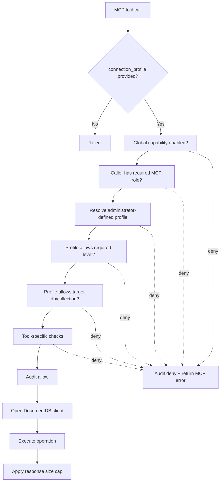

# DocumentDB MCP Server Design Review Notes

## 1. Overview

DocumentDB MCP Server is a Model Context Protocol server built for DocumentDB, allowing MCP clients or AI agents to access Azure DocumentDB / MongoDB-compatible DocumentDB in a controlled way. It exposes common database, collection, index, and document operations as MCP tools that can be invoked by VS Code agent, Copilot, Claude Desktop, or custom MCP clients. The server's core responsibility is to provide a tool execution entry point and apply authentication, authorization, connection configuration, and safety controls on the server side. All database tools are stateless and require an administrator-defined `connection_profile` on every call.

## 2. Features

### Tools And Capability Levels

The server currently exposes 18 tools across three risk levels: `read`, `write`, and `management`.

| Category | Tool | Level | Description |
| --- | --- | --- | --- |
| Database | `list_databases` | read | List databases, or list collections and estimated counts for one database. |
| Database | `drop_database` | management | Drop a database and all collections; requires `confirm_db_name`. |
| Collection | `sample_documents` | read | Return sample documents from a collection. |
| Collection | `get_statistics` | read | Return database, collection, or index statistics. |
| Collection | `drop_collection` | management | Drop a collection; requires `confirm_collection_name`. |
| Collection | `rename_collection` | management | Rename a collection with `dropTarget: false`. |
| Collection | `current_ops` | management | Return current MongoDB operations. |
| Index | `list_indexes` | read | List indexes for a collection. |
| Index | `create_index` | management | Create an index. |
| Index | `drop_index` | management | Drop an index; requires `confirm_index_name`. |
| Document | `find_documents` | read | Find documents with query and consolidated options. |
| Document | `count_documents` | read | Count documents matching a query. |
| Document | `aggregate` | read | Run an aggregation pipeline; `$out` and `$merge` are disabled by default. |
| Document | `explain_operation` | read | Explain find, count, or aggregate with execution stats. |
| Document | `insert_documents` | write | Insert one or more documents. |
| Document | `update_documents` | write | Update one or many documents. |
| Document | `delete_documents` | write | Delete one or many documents. |
| Document | `find_and_modify` | write | Atomically find and update one document. |

Level semantics:

- `read`: query and retrieval operations.
- `write`: document-level mutations such as insert, update, and delete; includes read access.
- `management`: higher-impact operations such as database, collection, index, and operational management; includes write and read access.

Some tools intentionally do not map one-to-one with native MongoDB APIs. This is by design: the MCP tool surface is compressed to reduce the number of tools exposed to AI agents and to avoid confusing tool selection. When a tool combines multiple related operations, the exact behavior is controlled by explicit input parameters, so the server can keep a smaller tool surface without making the operation ambiguous.

Examples:

- `list_databases` covers both list-database and database-info scenarios. Without `db_name`, it lists databases; with `db_name`, it returns collections and estimated counts for that database.
- `insert_documents` supports both single-document and multi-document insert through one tool.
- `update_documents` and `delete_documents` use `multi` parameter to cover one/many behavior.
- `get_statistics` unifies database, collection, and index statistics through `scope`.

The benefit is that the AI agent sees fewer, higher-level, less ambiguous tools, reducing accidental misuse caused by selecting the wrong low-level MongoDB API wrapper.

### Supported MCP Transports

The server supports three MCP transport modes. They expose the same tool surface, but differ in process model, authentication boundary, and recommended deployment scenario.

| Transport | Endpoint / Mode | Difference | Recommended scenario |
| --- | --- | --- | --- |
| `stdio` | Local child process launched by an MCP client | No HTTP endpoint. The MCP client talks to the server through standard input/output. It is simple and convenient, but has no per-request HTTP bearer token boundary. | Local development, demos, and single-user trusted desktop usage. |
| `streamable-http` | `POST /mcp` with MCP session support | HTTP-based transport with request middleware, rate limiting, Entra bearer token validation, and session handling. | Recommended for shared, remote, or production-style deployments. |
| `sse` | `GET /sse` and `POST /sse/messages` | Server-Sent Events transport for clients that still rely on the older SSE MCP pattern. It uses the same HTTP authentication and rate-limit middleware as HTTP. | Compatibility with MCP clients that do not yet support streamable HTTP. |

In short: use `stdio` for trusted local development, use `streamable-http` as the preferred production transport, and use `sse` only when client compatibility requires it.

## 3. Security Design

### Security Concern Without Server-Side Restrictions

If an MCP server simply exposes MongoDB driver operations without strong server-side restrictions, customers face a meaningful security concern.

Customers may deploy an open-source or standalone Azure DocumentDB MCP server package in their own environment and connect MCP clients, including AI agents such as VS Code agent, to it. The MCP server exposes tools in multiple categories:

- read/query operations,
- document write operations such as insert, update, and delete,
- database, collection, index management operations, and other management-plane-like actions.

Once configured, the MCP client can use these tools to interact with the underlying database in many ways, potentially executing management-plane-like actions under the user context. If the primary protection relies only on the database access rights assigned to the user, that is insufficient when actions are mediated by an AI agent.

The non-guarded approach has several weaknesses:

- **Insufficient server-enforced authorization boundaries across capability tiers**: without MCP-level authorization, read/write/management boundaries depend only on external database permissions that the MCP server does not control.
- **Over-reliance on client or framework confirmation prompts**: the design may assume that the MCP client asks for confirmation before execution, but most MCP clients cannot be assumed to do this consistently.
- **Connection-string credential path weakens per-user authorization at the MCP boundary**: if a shared connection string is used, the MCP server may be unable to perform reliable per-user backend authorization or attribution.
- **Accountability and attribution gap**: actions can appear as if performed by the user even when triggered by an agent, making it difficult to prove that the user intentionally approved the action.

Because of these weaknesses, a legitimate user may send a prompt that is misunderstood by an AI agent. The agent may then invoke tools that perform unwanted and possibly dangerous actions, including modifying documents, collections, indexes, or DocumentDB instances. Since the operations run through a valid security context and the MCP server cannot rely on client-side confirmations, impactful operations may execute without a reliably enforceable human-in-the-loop gate at the server boundary.

Potential losses include:

- **Availability / integrity loss**: unintended deletion or modification of important documents, collections, and indexes.
- **Financial impact**: unintended resource deployment or configuration changes that carry cost, with ambiguity over responsibility.
- **Compliance / privacy exposure**: even read-only access can be problematic in regulated environments if the agent accesses records without business need.
- **Incident-response ambiguity**: difficulty distinguishing AI-initiated actions from explicit user intent.

This risk arises from design choices and unsafe defaults, can lead to high-impact customer harm, has customer-wide blast radius, and over-relies on external systems such as MCP clients, framework confirmations, and user intent.

### Current Mitigations In This MCP Server

#### Entra ID Authentication For HTTP / SSE

For HTTP and SSE transports, the server validates Entra bearer tokens when `AUTH_REQUIRED=true` (by default).

Implementation details:

- Reads `Authorization: Bearer <token>` from the incoming request.
- Validates JWT signature with Entra tenant JWKS using `jose`.
- Validates issuer and audience using `ENTRA_TENANT_ID` and `ENTRA_AUDIENCE` / `ENTRA_CLIENT_ID`.
- Extracts caller identity and claims into request context: `oid`, `sub`, `tid`, `upn`, `name`, `roles`, `groups`, and `scp`.
- Authorization and audit logging read identity from this request context.

Why this helps:

- The MCP server can identify who is invoking tools.
- Customers can control access to the MCP endpoint using standard organizational identity controls.
- The server can make tool-level authorization decisions instead of treating all callers as equivalent.

#### Granular Role-Based Authorization

Each tool declares a required level: `read`, `write`, or `management`. The server maps token claim values from `roles`, `groups`, or `scp` to MCP roles using these environment variables:

```env
MCP_READ_ROLE_VALUES=DocumentDB.MCP.Read
MCP_WRITE_ROLE_VALUES=DocumentDB.MCP.Write
MCP_MANAGEMENT_ROLE_VALUES=DocumentDB.MCP.Management
```

Role hierarchy:

```text
management > write > read
```

Why this helps:

- Read-only users can be prevented from invoking mutation or management tools through MCP.
- Write users can modify documents without automatically getting collection/index/database management capabilities.
- Management actions are separated because they carry materially higher risk.

#### Global Capability Gates

The server has deployment-level capability flags:

```env
ENABLE_READ_TOOLS=true
ENABLE_WRITE_TOOLS=false
ENABLE_MANAGEMENT_TOOLS=false
```

Write and management tools are disabled by default even if code for those tools exists. Operators must explicitly opt in.

Why this helps:

- A fresh deployment exposes only read tools by default.
- A broad Entra role assignment alone cannot accidentally enable write or management tools.
- Customers must make an explicit risk decision before enabling higher-impact capabilities.

#### Administrator-Defined Connection Profiles

Every tool requires `connection_profile`. Tools do not accept runtime database connection strings from the AI agent or end user.

Profiles are configured by the MCP server administrator through `CONNECTION_PROFILES` or `CONNECTION_PROFILES_FILE`. Production profiles should use `authMode=entra` with MongoDB OIDC and Azure Identity. Connection-string profiles are still supported for local or sandbox use, but they are constrained to administrator-defined profiles rather than being supplied dynamically by the agent.

Why this helps:

- Agents cannot introduce unreviewed credentials at runtime.
- Database connectivity remains under organizational control.
- Customers can document and review the risk of any connection-string profile explicitly.

#### Profile-Level Capability And Resource Restrictions

Connection profiles can further restrict what the profile allows:

```json
{
  "prod-read": {
    "authMode": "entra",
    "endpoint": "prod.mongocluster.cosmos.azure.com",
    "tokenScope": "https://ossrdbms-aad.database.windows.net/.default",
    "allowedHosts": ["*.mongocluster.cosmos.azure.com"],
    "allowedRoles": ["read"],
    "allowedDatabases": ["fleet"],
    "allowedCollections": {
      "fleet": ["vehicles", "maintenance"]
    }
  }
}
```

Important semantics:

- `allowedRoles` omitted means read-only by default.
- `allowedRoles: []` means deny-all.
- `allowedDatabases` omitted means all databases; `[]` means deny-all.
- `allowedCollections[db]` omitted means all collections in that database; `[]` means deny-all for that database.

Why this helps:

- Even if global write tools are enabled, a production profile can remain read-only.
- A profile can be scoped to specific databases and collections.
- Compared with global capability flags, profile-level restrictions allow one MCP server instance on the same machine to serve multiple applications, environments, or workflows with different scopes. For example, one app can use `prod-read` for production read-only investigation while another app uses `sandbox-write` for test data mutation, without giving both apps the same backend scope.
- `list_databases` filters results based on profile scope, reducing unintended enumeration.

#### Tool-Specific Safety Controls

The server adds controls beyond role checks:

- Destructive operations require confirmation fields: `confirm_db_name`, `confirm_collection_name`, `confirm_index_name`.
- `aggregate` and `explain_operation` reject `$out` and `$merge` by default unless `ALLOW_AGGREGATE_WRITE_STAGES=true`.
- Query size and runtime are bounded with `MAX_FIND_LIMIT`, `MAX_SAMPLE_SIZE`, `MAX_INSERT_BATCH_SIZE`, `MAX_RETURN_BYTES`, and `MONGODB_MAX_TIME_MS`.
- All tool responses pass through `serializeResponse` to enforce a response-size cap.

Why this helps:

- Destructive operations require explicit target confirmation at the server side.
- Aggregation cannot silently become a write path by default.
- A malformed or overly broad agent request is less likely to overload the backend or flood the LLM context.

This is not redundant with authentication, RBAC, or profile-level checks. Those earlier gates answer **who** can call a tool and **which backend/resource scope** the tool may target. Tool-specific controls answer whether this particular operation is safe enough to execute after authorization has already passed, such as whether a destructive target was explicitly confirmed, whether an aggregation contains write stages, or whether the requested result size is too large.

#### Server-Side Guard Pipeline

All database tools are wrapped by `withDbGuard`, which applies the same enforcement path before opening a database connection.



Example:

- A caller with `DocumentDB.MCP.Read` invokes `find_documents` against `connection_profile=prod-read`, `db_name=fleet`, and `collection_name=vehicles`. If read tools are enabled and the profile allows `read` plus `fleet.vehicles`, the request passes the decision tree and reaches the backend.
- The same caller invokes `insert_documents`. If `ENABLE_WRITE_TOOLS=false`, the request is denied at `Global capability enabled?`. If write tools are globally enabled but `prod-read.allowedRoles=["read"]`, the request is denied at `Profile allows required level?`.
- The same caller invokes `find_documents` against `db_name=payroll`. If `payroll` is not in `allowedDatabases`, the request is denied at `Profile allows target db/collection?` before any database connection is opened.

#### Audit And Attribution

Allowed and denied invocations are logged to stderr with the `[MCP-AUDIT]` prefix. Audit events include tool name, required role, allow/deny decision, denial reason, connection profile, transport, session ID or request ID, and caller metadata such as `oid`, `sub`, `tid`, `upn`, and `name`.

Why this helps:

- Denied actions are explainable.
- Allowed actions are attributable to the caller identity available at the MCP boundary.
- Incident response has MCP-level evidence rather than only backend database logs.

## 4. Usage Flow

### Step 1: Download And Build The Package

Run from source:

```bash
git clone https://github.com/microsoft/documentdb-mcp.git
cd documentdb-mcp
npm install
npm run build
```

Or run directly from GitHub with `npx` in an MCP client config:

```bash
npx -y github:microsoft/documentdb-mcp
```

### Step 2: Choose Transport

For local development:

```env
TRANSPORT=stdio
ALLOW_UNAUTHENTICATED_STDIO=true
```

For shared or production-style deployment:

```env
TRANSPORT=streamable-http
HOST=localhost
PORT=8070
AUTH_REQUIRED=true
```

### Step 3: Configure Entra Application And Service Principal

For HTTP/SSE transports, the MCP server should be represented as an Entra-protected API/application.

The two Entra objects involved are:

- **Application / App Registration**: the global application definition. This is where the MCP server audience, app roles, and API permissions are defined.
- **Service Principal / Enterprise Application**: the tenant-local instance of that application. This is where users or groups are assigned to the app roles.

Recommended setup flow:

1. Create or use an Entra App Registration for the DocumentDB MCP server.
2. Use the Application client ID or configured API audience as the token audience.
3. Make sure a Service Principal exists for this application in the tenant. In the Azure portal, this appears under Enterprise Applications.
4. Configure the MCP server with the tenant and audience values:

```env
ENTRA_TENANT_ID=<tenant-id>
ENTRA_AUDIENCE=<application-client-id-or-api-audience>
```

The MCP client must send an Entra bearer token for this audience when calling HTTP/SSE endpoints. After role assignment, the issued token should contain role values in the `roles` claim.

### Step 4: Create And Assign MCP Roles

Create app roles on the Entra Application / App Registration. The role `value` fields should match the values that the MCP server expects:

| Entra app role value | MCP level | Intended users |
| --- | --- | --- |
| `DocumentDB.MCP.Read` | read | Users who can inspect/query data. |
| `DocumentDB.MCP.Write` | write | Users allowed to mutate documents. |
| `DocumentDB.MCP.Management` | management | Operators allowed to manage databases, collections, indexes, and operations. |

Then assign users or groups to these roles on the Service Principal / Enterprise Application. This assignment step is important: defining roles on the App Registration only declares what roles exist; assigning roles on the Service Principal controls who actually receives those roles in tokens.

Define role values in the MCP server environment:

```env
MCP_READ_ROLE_VALUES=DocumentDB.MCP.Read
MCP_WRITE_ROLE_VALUES=DocumentDB.MCP.Write
MCP_MANAGEMENT_ROLE_VALUES=DocumentDB.MCP.Management
```

At runtime, the MCP server reads role values from token claims and maps them to MCP capability levels. For example, a caller assigned `DocumentDB.MCP.Read` can invoke read tools, but cannot invoke write or management tools unless the token also contains the corresponding higher-level role.

### Step 5: Enable Tool Capability Tiers

Start with read-only defaults:

```env
ENABLE_READ_TOOLS=true
ENABLE_WRITE_TOOLS=false
ENABLE_MANAGEMENT_TOOLS=false
```

Enable higher-risk tiers only when needed:

```env
ENABLE_WRITE_TOOLS=true
ENABLE_MANAGEMENT_TOOLS=true
```

### Step 6: Configure Connection Profiles

Recommended production profile using Entra/OIDC:

```env
CONNECTION_PROFILES={"prod-read":{"authMode":"entra","endpoint":"prod.mongocluster.cosmos.azure.com","tokenScope":"https://ossrdbms-aad.database.windows.net/.default","allowedHosts":["*.mongocluster.cosmos.azure.com"],"allowedRoles":["read"],"allowedDatabases":["fleet"],"allowedCollections":{"fleet":["vehicles","maintenance"]}}}
```

Local development profile using a connection string:

```env
CONNECTION_PROFILES={"local":{"authMode":"connectionString","uri":"mongodb://localhost:27017","allowedRoles":["read"]}}
```

### Step 7: Configure The MCP Client

Example VS Code MCP configuration for local stdio:

```json
{
  "mcp.servers": {
    "documentdb": {
      "command": "npx",
      "args": ["-y", "github:microsoft/documentdb-mcp"],
      "env": {
        "TRANSPORT": "stdio",
        "ALLOW_UNAUTHENTICATED_STDIO": "true",
        "CONNECTION_PROFILES": "{\"local\":{\"authMode\":\"connectionString\",\"uri\":\"mongodb://localhost:27017\",\"allowedRoles\":[\"read\"]}}"
      }
    }
  }
}
```

### Step 8: Invoke Tools

Read example:

```json
{
  "connection_profile": "prod-read",
  "db_name": "fleet",
  "collection_name": "vehicles",
  "query": { "status": "active" },
  "options": { "limit": 5 }
}
```

Write example, requiring `ENABLE_WRITE_TOOLS=true`, a caller with write role, and a profile that includes `allowedRoles: ["read", "write"]`:

```json
{
  "connection_profile": "sandbox-write",
  "db_name": "mcp_validation",
  "collection_name": "vehicles",
  "documents": {
    "vin": "VIN-100",
    "make": "Contoso",
    "model": "Test",
    "status": "active"
  }
}
```

### Step 9: Monitor Audit Logs

Watch stderr or centralized logs for `[MCP-AUDIT]` events. These records show which tool was invoked, whether it was allowed or denied, which profile was used, and which caller identity was attached to the request.
